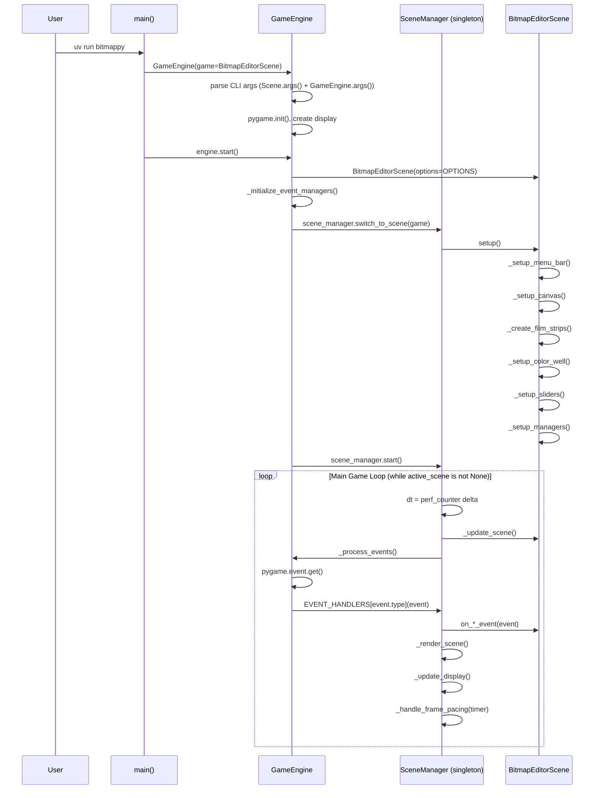
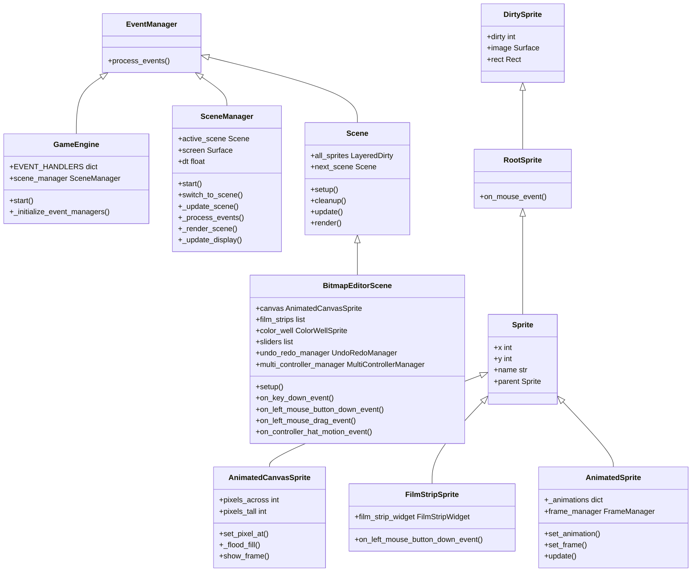
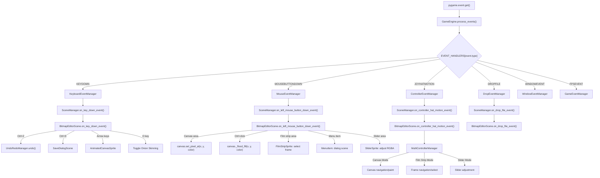
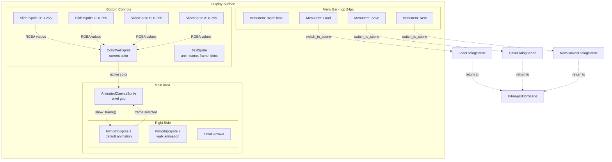
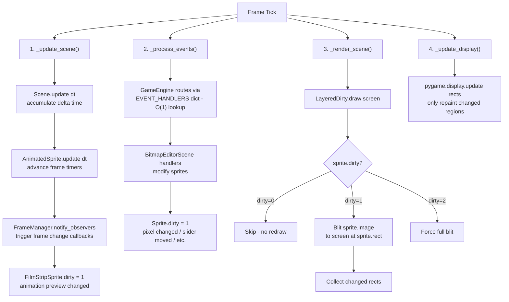
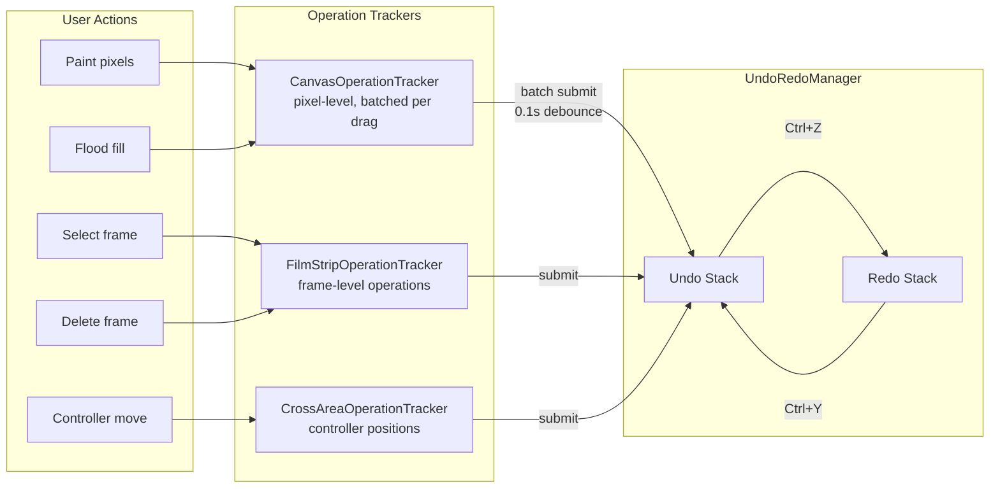
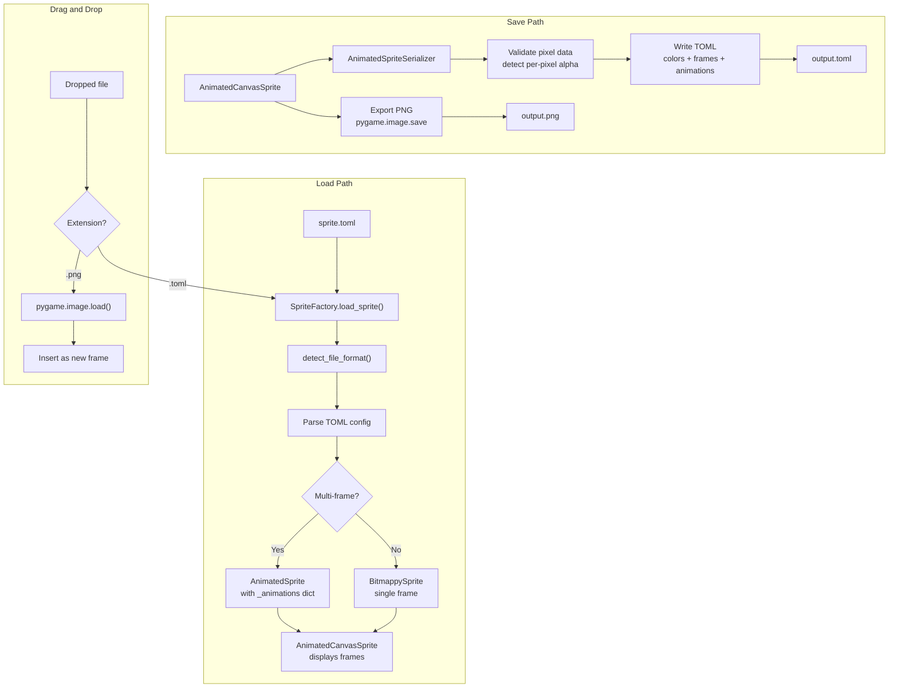
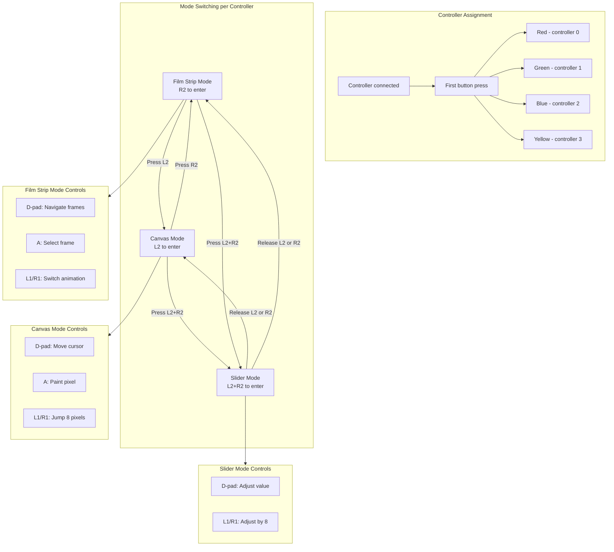

# Bitmappy Architecture Diagrams

See the rendered version in the [mkdocs documentation](docs/architecture/bitmappy.md).

## 1. Bootstrap & Main Loop

## 2. Class Hierarchy

## 3. Event Flow

## 4. UI Layout & Component Wiring

## 5. Rendering Pipeline

## 6. Undo/Redo & Operations

## 7. Sprite Load/Save Pipeline

## 8. Multi-Controller System

