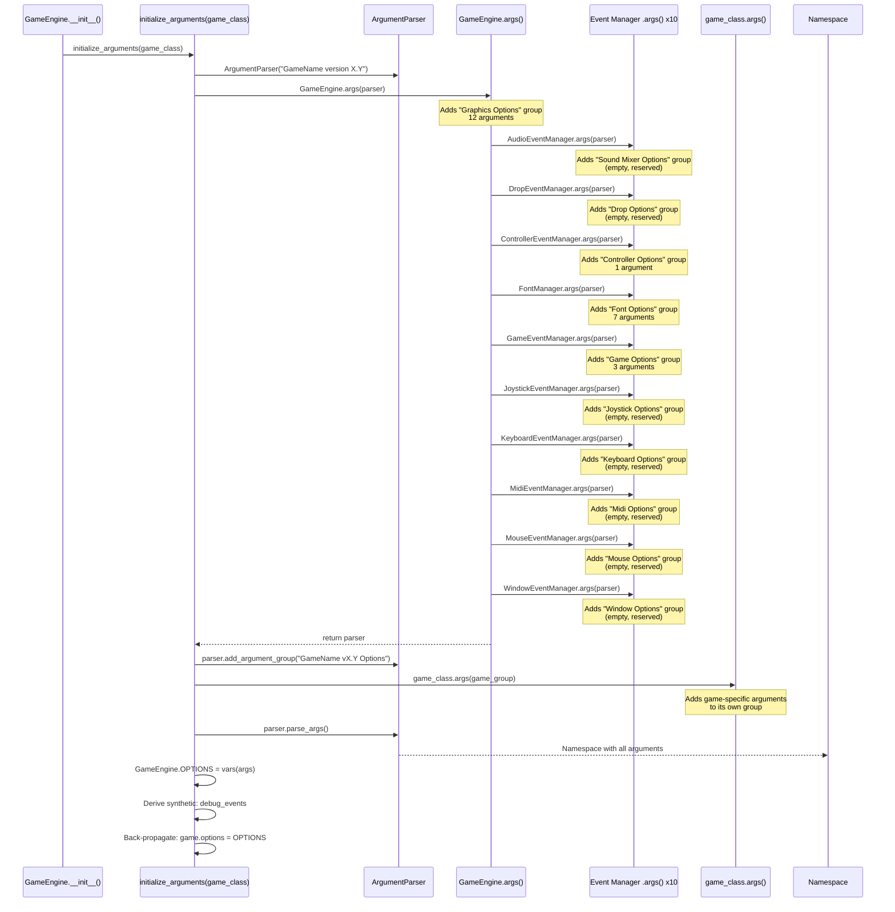
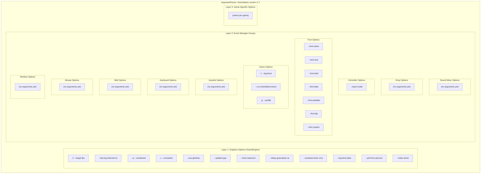
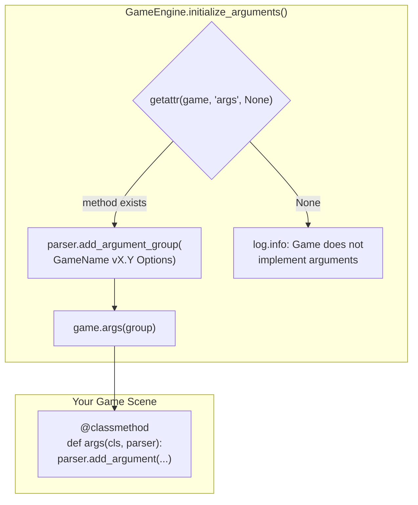
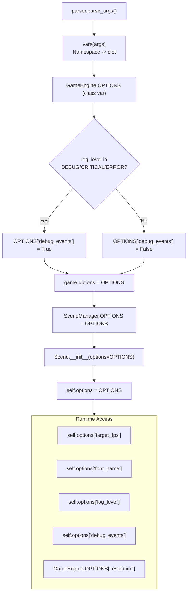

# Command-Line Argument System

GlitchyGames uses a composable argparse architecture where the engine, event managers,
font system, and individual games each contribute argument groups to a single parser.
Every game built on the engine automatically inherits all engine-level flags, and can
extend the parser with its own game-specific options.

## How Arguments Are Assembled

The orchestration happens in `GameEngine.initialize_arguments()`, called from
`GameEngine.__init__()`. The flow is:



## The Argument Group Hierarchy

Each layer adds its own `add_argument_group()`, producing clearly separated
sections in `--help` output. The hierarchy mirrors the engine architecture.



## How Games Add Arguments

A game adds arguments by defining a `@classmethod` called `args()` on its scene class.
The engine discovers this method via `getattr(game, 'args', None)` and calls it with
a dedicated argument group. If the game does not define `args()`, the engine logs an
informational message and continues.



### Pattern: Minimal Game

```python
class MyGame(Scene):
    NAME = 'My Game'
    VERSION = '1.0'

    @classmethod
    def args(cls, parser):
        parser.add_argument(
            '-v', '--version',
            action='store_true',
            help='print the game version and exit',
        )
```

### Pattern: Game with Custom Options

```python
class JoystickDemo(Scene):
    NAME = 'Joystick Demo'
    VERSION = '1.0'

    @classmethod
    def args(cls, parser):
        parser.add_argument(
            '--time', type=int, default=10,
            help='time in seconds to wait before quitting',
        )
        parser.add_argument(
            '-v', '--version',
            action='store_true',
            help='print the game version and exit',
        )
```

Note that the game receives an **argument group**, not the root parser. This means
game arguments appear under their own heading in `--help` output.

## OPTIONS Dictionary Flow

After parsing, the `Namespace` is converted to a plain dict and propagated to
every component that needs it.



## Complete Flag Reference

### Graphics Options

Added by `GameEngine.args()` in `glitchygames/engine/game_engine.py`.

| Flag | Type | Default | Description |
|------|------|---------|-------------|
| `-f`, `--target-fps` | `float` | `0.0` (infinite) | Cap the framerate |
| `--fps-log-interval-ms` | `float` | `1000` | How often to log the FPS counter in ms |
| `-w`, `--windowed` | `store_true` | `True` | Run in windowed mode |
| `-r`, `--resolution` | `str` | `800x480` | Display resolution (WxH) |
| `--use-gfxdraw` | `store_true` | `False` | Use pygame.gfxdraw for rendering |
| `--update-type` | `choice` | `update` | Display update method: `update` or `flip` |
| `--timer-backend` | `choice` | `pygame` | Timer backend: `pygame` or `fast` |
| `--sleep-granularity-ns` | `int` | `1000000` | Minimum sleep granularity for pacing (ns); 0 to uncap |
| `--windows-timer-1ms` | `store_true` | `False` | On Windows, request 1ms system timer resolution |
| `--log-timer-jitter` | `store_true` | `False` | Log frame pacing jitter statistics periodically |
| `--perf-trim-percent` | `float` | `5.0` | Percent of frames to trim from top and bottom in FPS report |
| `--video-driver` | `choice` | `None` | Platform-specific video driver (see below) |

**`--video-driver` choices by platform:**

| Platform | Choices |
|----------|---------|
| Linux | `wayland`, `x11`, `dga`, `fbcon`, `directfb`, `ggi`, `vgl`, `svgalib`, `aalib` |
| Windows | `windib`, `directx` |
| macOS | (none currently defined) |

### Game Options

Added by `GameEventManager.args()` in `glitchygames/events/game.py`.

| Flag | Type | Default | Description |
|------|------|---------|-------------|
| `-l`, `--log-level` | `choice` | `info` | Logging level: `debug`, `info`, `warning`, `error`, `critical` |
| `--no-unhandled-events` | `store_true` | `False` | Raise `UnhandledEventError` on unhandled events |
| `-p`, `--profile` | `store_true` | `False` | Enable cProfile profiling |

### Controller Options

Added by `ControllerEventManager.args()` in `glitchygames/events/controller.py`.

| Flag | Type | Default | Description |
|------|------|---------|-------------|
| `--input-mode` | `choice` | `controller` | Input event family: `joystick` or `controller` |

### Font Options

Added by `FontManager.args()` in `glitchygames/fonts/font_manager.py`.

| Flag | Type | Default | Description |
|------|------|---------|-------------|
| `--font-name` | `str` | `arial` | Font name |
| `--font-size` | `int` | `14` | Font size in points |
| `--font-bold` | `store_true` | `False` | Bold font |
| `--font-italic` | `store_true` | `False` | Italic font |
| `--font-antialias` | `store_true` | `False` | Enable font antialiasing |
| `--font-dpi` | `int` | `72` | Font DPI |
| `--font-system` | `choice` | `freetype` | Font system: `freetype` (enhanced) or `pygame` (built-in) |

### Reserved Groups (Empty, No Arguments Yet)

These groups exist as extension points. Each event manager creates its argument group
but does not currently populate it with any flags.

| Group Name | Source File | Manager Class |
|------------|------------|---------------|
| Sound Mixer Options | `events/audio.py` | `AudioEventManager` |
| Drop Options | `events/drop.py` | `DropEventManager` |
| Joystick Options | `events/joystick.py` | `JoystickEventManager` |
| Keyboard Options | `events/keyboard.py` | `KeyboardEventManager` |
| Midi Options | `events/midi.py` | `MidiEventManager` |
| Mouse Options | `events/mouse.py` | `MouseEventManager` |
| Window Options | `events/window.py` | `WindowEventManager` |

### Synthetic Options (Not from argparse)

These are derived after parsing and injected into the OPTIONS dict.

| Key | Type | Derived From | Description |
|-----|------|-------------|-------------|
| `debug_events` | `bool` | `log_level` | `True` when log_level is `debug`, `critical`, or `error` |

## Bitmappy Game-Specific Arguments

Added by `BitmapEditorScene.args()` in `glitchygames/tools/bitmappy.py`.
These appear under the heading **"Bitmappy vX.Y Options"** in `--help`.

| Flag | Type | Default | Description |
|------|------|---------|-------------|
| `-v`, `--version` | `store_true` | `False` | Print the game version and exit |
| `-s`, `--size` | `str` | `32x32` | Canvas size (WxH in pixels) |

## Example Game Arguments

Other games in the project demonstrate the pattern:

| Game | File | Arguments |
|------|------|-----------|
| Paddle Slap | `examples/paddleslap.py` | `-v, --version` |
| DT Demo | `examples/dt_demo.py` | `-v, --version` |
| Joystick Demo | `examples/joystick_demo.py` | `--time` (int, default 10), `-v, --version` |
| Bitrot Adventures | `scripts/bitrotadventures.py` | `-s, --some-game-specific-option` |
| Animation Demo | `scripts/animation_scene_full_demo.py` | `-v, --version` |

## What `--help` Looks Like

When a user runs `uv run bitmappy --help`, argparse produces output structured
like this (argument groups appear in registration order):

```
usage: Bitmappy version X.Y [-h] [-f TARGET_FPS] [...]

options:
  -h, --help            show this help message and exit

Graphics Options:
  -f, --target-fps      cap the framerate (default: infinite)
  --fps-log-interval-ms how often to log the FPS counter in ms (default: 1000)
  -w, --windowed        run the program in windowed mode
  -r, --resolution      the resolution to use (default: 1024x768)
  --use-gfxdraw
  --update-type         update or flip (default: update)
  --timer-backend       timer backend for draw loop pacing (pygame|fast)
  --sleep-granularity-ns minimum sleep granularity for pacing (ns); 0 to uncap
  --windows-timer-1ms   on Windows, request 1ms system timer resolution
  --log-timer-jitter    log frame pacing jitter statistics periodically
  --perf-trim-percent   percent of frames to trim in global FPS report
  --video-driver

Sound Mixer Options:

Drop Options:

Controller Options:
  --input-mode          Choose input event family to use (default: controller)

Font Options:
  --font-name
  --font-size
  --font-bold
  --font-italic
  --font-antialias
  --font-dpi
  --font-system         Font system to use: freetype or pygame

Game Options:
  -l, --log-level       set the logging level
  --no-unhandled-events fail on unhandled events
  -p, --profile         enable profiling

Joystick Options:

Keyboard Options:

Midi Options:

Mouse Options:

Window Options:

Bitmappy vX.Y Options:
  -v, --version         print the game version and exit
  -s, --size
```

## How to Add Arguments to a New Event Manager

If you are adding arguments to a currently-empty event manager group, follow the
existing pattern:

```python
# In glitchygames/events/mouse.py

@classmethod
def args(cls, parser: argparse.ArgumentParser) -> argparse.ArgumentParser:
    group = parser.add_argument_group('Mouse Options')

    group.add_argument(
        '--mouse-sensitivity',
        type=float,
        default=1.0,
        help='Mouse sensitivity multiplier (default: 1.0)',
    )

    return parser
```

The engine already calls your manager's `args()` method — you just need to
add `add_argument()` calls to the existing group.

## How to Create a New Game with Arguments

```python
from glitchygames.engine import GameEngine
from glitchygames.scenes import Scene


class MyGame(Scene):
    NAME = 'My Game'
    VERSION = '1.0'

    @classmethod
    def args(cls, parser):
        """Add game-specific arguments.

        Args:
            parser: An argument group (not the root parser).
        """
        parser.add_argument(
            '-v', '--version',
            action='store_true',
            help='print the game version and exit',
        )
        parser.add_argument(
            '--difficulty',
            choices=['easy', 'medium', 'hard'],
            default='medium',
            help='game difficulty level',
        )

    def __init__(self, options):
        super().__init__(options=options)
        # Access your arguments via self.options
        self.difficulty = self.options['difficulty']


def main():
    GameEngine(game=MyGame).start()
```

Your arguments will automatically appear under **"My Game v1.0 Options"** in
the `--help` output, separate from all engine-level flags.
