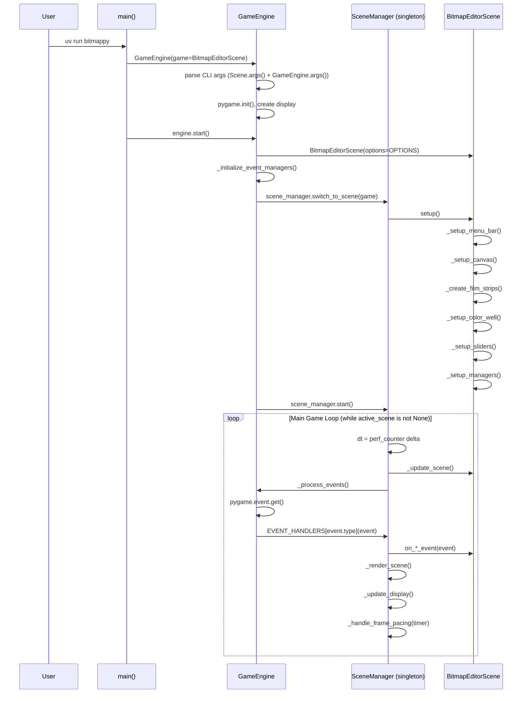
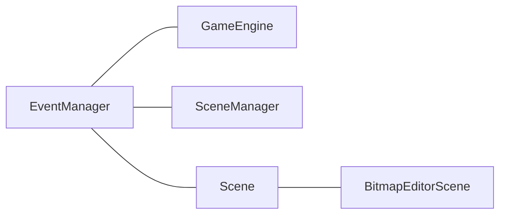
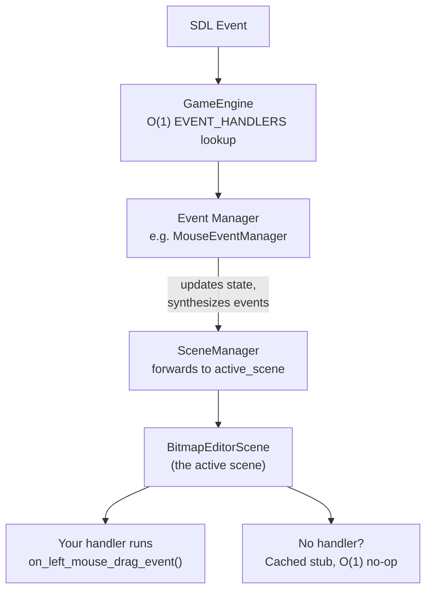
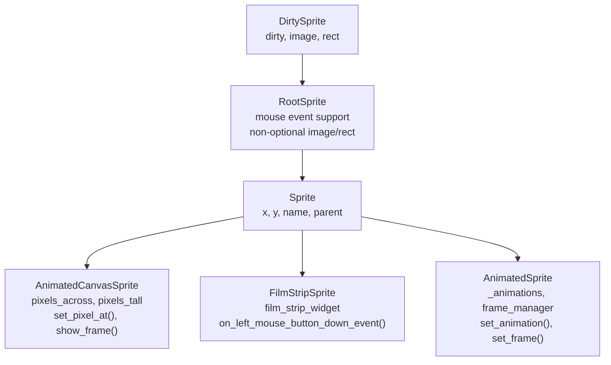
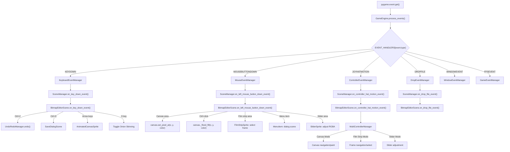
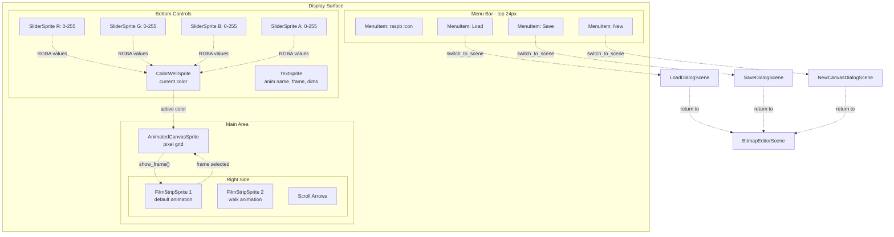
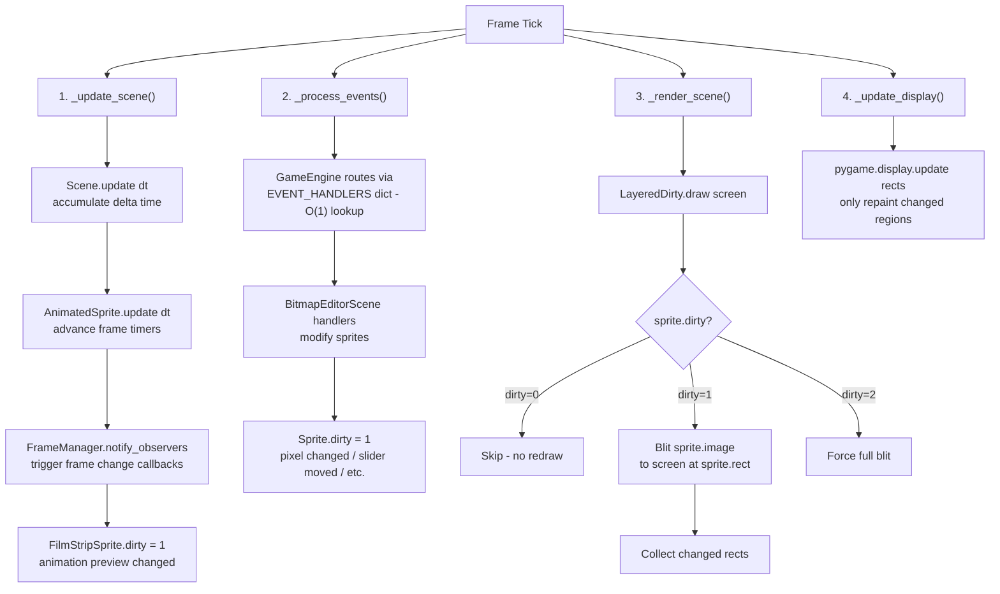
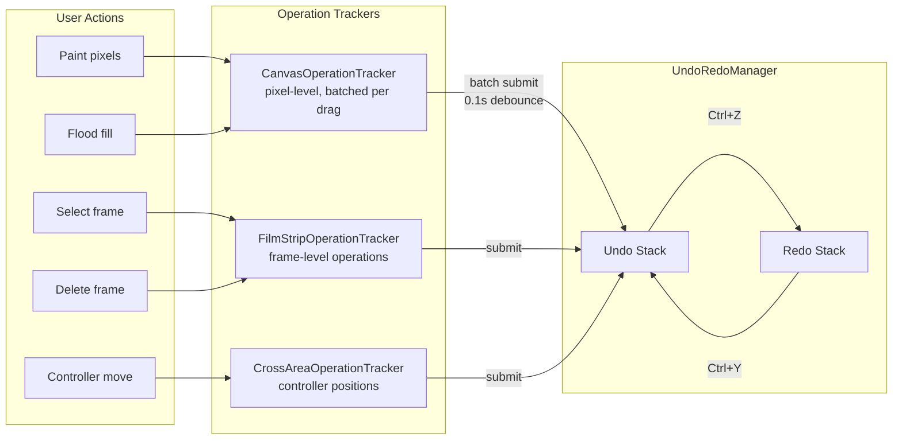
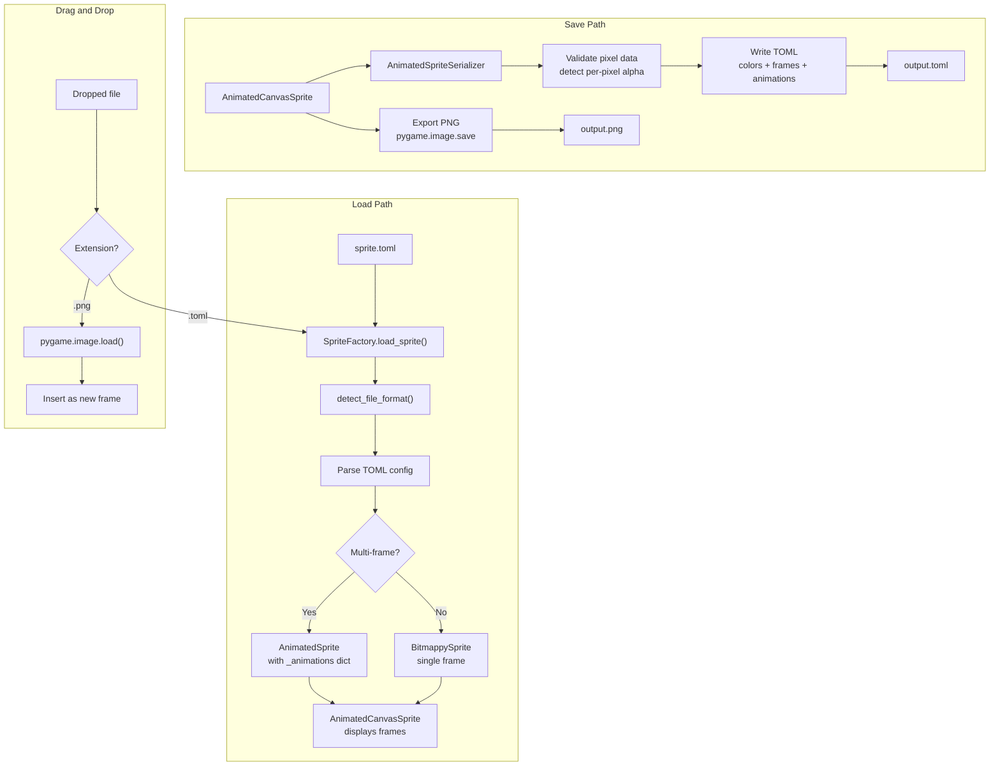
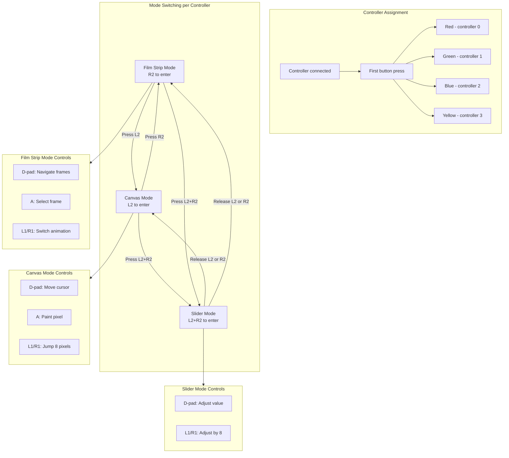

# Bitmappy Architecture

Bitmappy is GlitchyGames' pixel art editor. These diagrams show how it is wired up
through the engine, from bootstrap to rendering.

## Bootstrap & Main Loop

How Bitmappy starts up: entry point through `main()`, GameEngine initialization,
scene setup, and the four-phase main loop.

## Class Hierarchy

### Event dispatch chain (how events reach your scene)

`EventManager` is the base class for `GameEngine`, `SceneManager`, and every
`Scene`. This shared base is why events can flow through all of them using the
same `on_*_event()` API.

**Inheritance** — all dispatch chain classes share the `EventManager` base:

**Event flow** — how an SDL event reaches your handler in Bitmappy:

The `GameEngine` receives every SDL event and does an O(1) dict lookup to find
the right event manager. The event manager updates its internal state (button
tracking, axis values, drag detection) and may synthesize higher-level events
(drag, drop, chord). It then forwards to the `SceneManager`, which passes
everything to the `active_scene`. In Bitmappy, that's `BitmapEditorScene`,
which overrides handlers like `on_key_down_event()`,
`on_left_mouse_button_down_event()`, `on_left_mouse_drag_event()`, and
`on_controller_hat_motion_event()`. Events it doesn't override hit the cached
stubs — O(1) no-ops after their first occurrence.

### Sprite hierarchy (renderable objects)

`DirtySprite` is pygame's base for all sprites that support dirty-rect
rendering. GlitchyGames extends it through `RootSprite` → `Sprite` to add
mouse events, non-optional `image`/`rect`, and named parent tracking.

## Event Flow

How pygame events propagate through the system: from `pygame.event.get()` through
the `EVENT_HANDLERS` dispatch table, into specialized event managers, through the
scene manager, and finally into Bitmappy's scene and sprite handlers.

## UI Layout & Component Wiring

How the UI components are arranged on screen and how data flows between them.
Dotted lines show data flow; solid lines show scene transitions via `switch_to_scene`.

## Rendering Pipeline

The four phases of each frame tick. Dirty-rect optimization ensures only changed
regions are redrawn and pushed to the display.

## Undo/Redo & Operations

How user actions flow through operation trackers into the central undo/redo stack.
Canvas operations are batched per drag with 0.1s debounce for efficiency.

## Sprite Load/Save Pipeline

How sprites are loaded from TOML files, saved back, and imported via drag-and-drop.

## Multi-Controller System

Up to 4 color-coded controllers can operate simultaneously. Each controller
independently switches between three modes using shoulder buttons.

