# Event System Architecture

GlitchyGames makes it easy to port simple pygame projects into more advanced games
with little effort. If you already have a pygame game using `pygame.event.get()` and
if/elif chains, you can bring it into GlitchyGames and immediately benefit from
named event handlers, automatic state tracking, and synthesized higher-level events
— without rewriting your existing event logic.

Both event systems work together inside GlitchyGames. You can keep calling
`pygame.event.get()`, `pygame.key.get_pressed()`, or any other raw pygame API
alongside the GlitchyGames `on_*_event()` handlers. This makes porting
incremental: start with your existing code, then adopt GlitchyGames handlers one
event at a time as you need their benefits.

**What GlitchyGames adds on top of raw pygame:**

- **Named handlers** — override `on_key_down_event()` instead of writing
  `if event.type == pygame.KEYDOWN`. No if/elif dispatch chains.
- **Automatic state tracking** — event managers cache button states, axis
  values, hat positions, and mouse focus so you can poll current state anytime.
- **Synthesized events** — GlitchyGames generates events that pygame doesn't
  provide: mouse drag and drop (`on_left_mouse_drag_event`,
  `on_left_mouse_drop_event`), keyboard chords (`on_key_chord_down_event`),
  per-button mouse events (`on_left_mouse_button_down_event` vs raw
  `MOUSEBUTTONDOWN` with a button field), and sprite focus tracking
  (`on_mouse_focus_event`, `on_mouse_unfocus_event`).
- **Custom event types** — three engine-level event types (`FPSEVENT`,
  `GAMEEVENT`, `MENUEVENT`) built on `pygame.USEREVENT` offsets, plus an
  extensible `GAMEEVENT` bus for posting arbitrary game-specific events with
  per-subtype callbacks.
- **Performance caching** — unhandled event stubs use `@functools.cache` so
  events your scene doesn't handle cost O(1) after their first occurrence,
  even when firing hundreds of times per second.

Events flow from SDL through pygame, into specialized event managers that track
state and synthesize higher-level events, through the scene manager, and finally
into scenes and sprites.

## Event Dispatch Overview

The complete path an event takes from SDL to your scene handler. The `EVENT_HANDLERS`
dict provides O(1) lookup from pygame event type to the correct processing method.

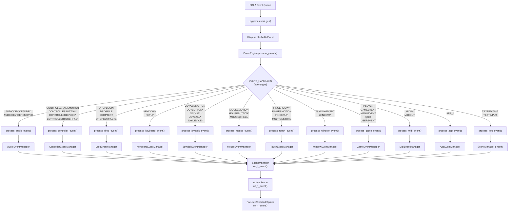

### Event performance tiers

Not all events pay the same cost. Events fall into three tiers depending on
whether they're blocked, unhandled, or handled:

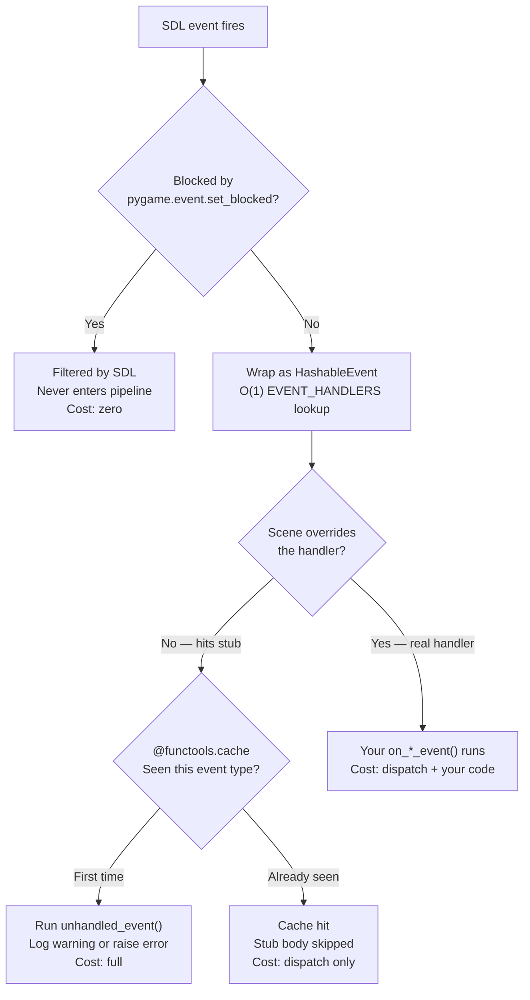

| Tier | When | Cost per occurrence | Example |
|---|---|---|---|
| **Blocked** | `pygame.event.set_blocked(type)` | Zero — SDL filters it before `pygame.event.get()` | Disabling `MOUSEMOTION` in a menu-only scene |
| **Unhandled (first)** | Stub catches event, first occurrence | Full dispatch path + `unhandled_event()` log | First `JOYAXISMOTION` when no joystick handler exists |
| **Unhandled (cached)** | Same stub, subsequent occurrences | Dispatch path + O(1) cache hit, stub body skipped | 2nd through Nth `JOYAXISMOTION` — no log, no work |
| **Handled** | Scene overrides `on_*_event()` | Full dispatch path + your handler executes | `on_key_down_event()` processing a key press |

The `EVENT_HANDLERS` dict lookup is O(1) for all events that reach the pipeline.
The `@functools.cache` on stubs makes the stub *execution* O(1) after first
occurrence — but the event still travels through the dispatch path (wrap in
HashableEvent, dict lookup, proxy forwarding) before reaching the cached stub.
To eliminate that dispatch cost entirely, block the event at the pygame level
with `pygame.event.set_blocked()`.

## Custom Event Types

GlitchyGames defines three custom event types beyond the standard pygame events.
These are registered as `USEREVENT` offsets rather than using `pygame.event.custom_type()`
to avoid consuming IDs from pygame's limited custom event ID pool. Pygame allocates
custom types by incrementing from `USEREVENT`, so once an ID is taken it's gone for
the lifetime of the process. By using fixed offsets (`USEREVENT + 1`, `+ 2`, `+ 3`),
the engine's internal events occupy a known, predictable range and leave the rest of
the pool free for game-specific events registered via `custom_type()`.

These constants are defined in `glitchygames/events/core.py`:

```py
FPSEVENT  = pygame.USEREVENT + 1  # FPS counter updates
GAMEEVENT = pygame.USEREVENT + 2  # Game-specific events (extensible via subtypes)
MENUEVENT = pygame.USEREVENT + 3  # Menu item selections
```

`GAMEEVENT` is intentionally generic — game code posts events with arbitrary
payloads via `GameEngine.post_game_event()`, and can register per-subtype
callbacks via `GameEngine.register_game_event()`. This gives games an extensible
event bus without consuming additional pygame event IDs.

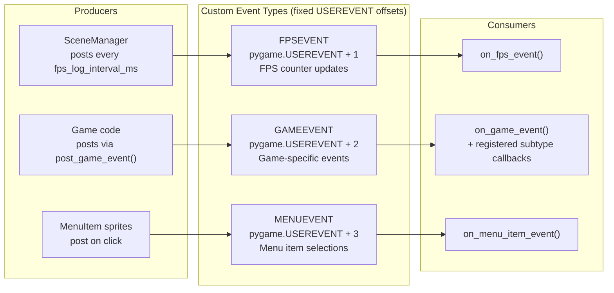

### Extending GAMEEVENT in your game

`GAMEEVENT` is designed as an extensible event bus. Instead of consuming
additional pygame event IDs for each game-specific event, you define integer
subtypes and register callbacks for them. All subtypes share the single
`GAMEEVENT` ID.

Here's how a game might define custom events for a scoring system and a
power-up system:

```py
# Define your game's event subtypes as constants
SCORE_CHANGED = 1
POWER_UP_COLLECTED = 2
LEVEL_COMPLETE = 3

class MyGame(Scene):
    def setup(self):
        # Register callbacks for each subtype
        self.register_game_event(SCORE_CHANGED, self.on_score_changed)
        self.register_game_event(POWER_UP_COLLECTED, self.on_power_up)
        self.register_game_event(LEVEL_COMPLETE, self.on_level_complete)

    def on_score_changed(self, event: HashableEvent):
        new_score = event.score
        self.hud.update_score(new_score)

    def on_power_up(self, event: HashableEvent):
        power_type = event.power_type
        duration = event.duration
        self.player.apply_power_up(power_type, duration)

    def on_level_complete(self, event: HashableEvent):
        self.switch_to_scene(LevelTransitionScene(event.next_level))
```

Any code in the game can fire these events:

```py
# From a collision handler, enemy class, pickup sprite, etc.
self.game_engine.post_game_event(
    event_subtype=SCORE_CHANGED,
    event_data={'score': self.score},
)

self.game_engine.post_game_event(
    event_subtype=POWER_UP_COLLECTED,
    event_data={'power_type': 'speed_boost', 'duration': 5.0},
)
```

Under the hood, `post_game_event` creates a `pygame.event.Event` with type
`GAMEEVENT` and a `subtype` field, then posts it to pygame's event queue.
When the `SceneManager` processes it via `on_game_event()`, it looks up
`registered_events[event.subtype]` and calls the matching callback. If no
callback is registered for that subtype, it logs an error telling you to
call `register_game_event()`.

This pattern gives you an unlimited number of game-specific event types
while consuming only one pygame event ID.

## Event Manager Class Hierarchy

Every event manager follows the same structural pattern: a `ResourceManager` singleton
that owns one or more inner proxy objects. The proxy implements the event interface
and forwards calls to the game object.

```mermaid
classDiagram
    class ResourceManager {
        +__instances__ dict
        +proxies list
        +__new__() enforces singleton
        +__getattr__() proxies to children
    }

    class EventInterface {
        <<abstract>>
        +on_*_event() abstract methods
    }

    class EventStubs {
        +on_*_event() cached unhandled_event()
    }

    class AudioEventManager {
        +AudioEventProxy proxy
        +on_audio_device_added_event()
        +on_audio_device_removed_event()
    }

    class ControllerEventManager {
        +controllers dict
        +on_controller_axis_motion_event()
        +on_controller_button_down_event()
        +on_controller_button_up_event()
        +on_controller_device_added_event()
        +on_controller_device_remapped_event()
        +on_controller_device_removed_event()
        +on_controller_touchpad_down_event()
        +on_controller_touchpad_motion_event()
        +on_controller_touchpad_up_event()
    }

    class KeyboardEventManager {
        +keys dict
        +on_key_down_event()
        +on_key_up_event()
        +on_key_chord_down_event()
        +on_key_chord_up_event()
    }

    class MouseEventManager {
        +mouse_state dict
        +mouse_dragging bool
        +current_focus Sprite
        +on_mouse_motion_event()
        +on_mouse_button_down_event()
        +on_mouse_button_up_event()
        +on_mouse_drag_event()
        +on_mouse_drop_event()
        +on_mouse_wheel_event()
        +on_mouse_focus_event()
        +on_mouse_unfocus_event()
    }

    class JoystickEventManager {
        +joysticks dict
        +on_joy_axis_motion_event()
        +on_joy_button_down_event()
        +on_joy_button_up_event()
        +on_joy_hat_motion_event()
        +on_joy_ball_motion_event()
        +on_joy_device_added_event()
        +on_joy_device_removed_event()
    }

    class WindowEventManager {
        +on_window_close_event()
        +on_window_focus_gained_event()
        +on_window_focus_lost_event()
        +on_window_resized_event()
        +on_window_moved_event()
        +on_window_minimized_event()
        +on_window_maximized_event()
        +on_window_restored_event()
        +on_window_shown_event()
        +on_window_hidden_event()
        +on_window_exposed_event()
        +on_window_enter_event()
        +on_window_leave_event()
        +on_window_size_changed_event()
        +on_window_take_focus_event()
    }

    class GameEventManager {
        +on_fps_event()
        +on_game_event()
        +on_menu_item_event()
        +on_quit_event()
        +on_active_event()
        +on_video_resize_event()
        +on_video_expose_event()
        +on_clipboard_update_event()
        +on_locale_changed_event()
    }

    class DropEventManager {
        +on_drop_begin_event()
        +on_drop_file_event()
        +on_drop_text_event()
        +on_drop_complete_event()
    }

    class TouchEventManager {
        +fingers dict
        +on_touch_down_event()
        +on_touch_motion_event()
        +on_touch_up_event()
        +on_multi_touch_down_event()
        +on_multi_touch_motion_event()
        +on_multi_touch_up_event()
    }

    class MidiEventManager {
        +on_midi_in_event()
        +on_midi_out_event()
    }

    class AppEventManager {
        +on_app_terminating_event()
        +on_app_low_memory_event()
        +on_app_did_enter_background_event()
        +on_app_did_enter_foreground_event()
        +on_app_will_enter_background_event()
        +on_app_will_enter_foreground_event()
    }

    EventInterface <|.. EventStubs
    ResourceManager <|-- AudioEventManager
    ResourceManager <|-- ControllerEventManager
    ResourceManager <|-- KeyboardEventManager
    ResourceManager <|-- MouseEventManager
    ResourceManager <|-- JoystickEventManager
    ResourceManager <|-- WindowEventManager
    ResourceManager <|-- GameEventManager
    ResourceManager <|-- DropEventManager
    ResourceManager <|-- TouchEventManager
    ResourceManager <|-- MidiEventManager
    ResourceManager <|-- AppEventManager
```

## ResourceManager Proxy Pattern

Each event manager is a singleton `ResourceManager` that delegates to inner proxy
objects. The proxy chain provides two capabilities:

1. **Event dispatch**: When `GameEngine` calls `on_*_event()` on an event manager
   (e.g., `MouseEventManager`), the event manager forwards to its inner proxy,
   which updates internal state (tracking pressed keys, button states, drag
   sequences, etc.) and then forwards the event to `self.game` — the active scene.

2. **Transparent pygame API access**: When game code accesses a pygame subsystem
   method through the manager (e.g., `mouse_manager.get_pos()`), the
   `__getattr__` proxy chain resolves it. The manager doesn't find `get_pos()` on
   itself, so it walks `self.proxies` — first the inner proxy (which also doesn't
   have it), then the pygame module (`pygame.mouse`), where it's found. This means
   game code can call pygame APIs through the manager without knowing which object
   actually implements them.

**Why this matters**: Scenes and sprites never need a direct reference to
`pygame.mouse`, `pygame.key`, or `pygame.joystick`. They talk to the event
manager, which is a singleton accessible from anywhere. The manager handles state
tracking (what buttons are held, what sprite has mouse focus, what keys form a
chord) while transparently exposing the underlying pygame API. If a pygame
subsystem changes its interface, only the proxy needs to adapt — game code is
insulated.

### Architecture

Each manager follows the same two-layer structure:

```
MouseEventManager (singleton ResourceManager)
├── proxies: [MouseEventProxy]
│
└── MouseEventProxy (inner class, also a ResourceManager)
    ├── proxies: [self.game, pygame.mouse]
    ├── state: mouse_state, dragging, focus tracking
    └── on_*_event(): update state, synthesize events, forward to self.game
```

The inner proxy holds the real state and logic. The outer manager is just a
singleton wrapper that ensures only one proxy chain exists per subsystem.

### Proxy resolution order

When an attribute is accessed on a manager, Python's `__getattr__` walks the
proxy list in order. The first proxy that has the attribute wins:

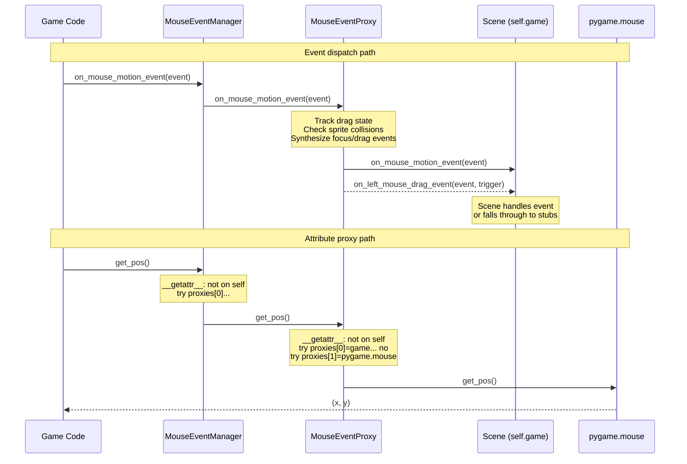

### Proxy lists by manager

Each manager configures its proxy list to expose the relevant pygame subsystem:

| Manager | Proxy list | pygame API exposed |
|---|---|---|
| `MouseEventManager` | `[self.game, pygame.mouse]` | `get_pos()`, `set_visible()`, etc. |
| `KeyboardEventManager` | `[self.game, pygame.key]` | `get_pressed()`, `get_mods()`, etc. |
| `AudioEventManager` | `[self.game, pygame.mixer]` | `get_busy()`, `set_num_channels()`, etc. |
| `JoystickEventManager` | `[self.game, self.joystick]` | Per-joystick: `get_axis()`, `get_button()`, etc. |
| `TouchEventManager` | `[self.game, pygame._sdl2.touch]` | `get_num_devices()`, etc. |
| `DropEventManager` | `[self.game]` | No pygame subsystem (events only) |
| `GameEventManager` | `[self.game]` | No pygame subsystem (events only) |
| `AppEventManager` | `[self.game]` | No pygame subsystem (events only) |
| `MidiEventManager` | `[self.game, pygame.midi]` | `get_count()`, `get_device_info()`, etc. |

Managers without a pygame subsystem in their proxy list (like `DropEventManager`)
only forward events — `__getattr__` falls through to the game object.

### Singleton guarantee

`ResourceManager.__new__` maintains a class-level `__instances__` dict keyed by
concrete class type. Constructing `MouseEventManager(game)` a second time returns
the original instance. This means any scene, sprite, or helper can do
`MouseEventManager()` to get the existing manager without needing the game
reference passed around — the singleton already has it from first initialization.

## HashableEvent Wrapper

Raw pygame events are wrapped in `HashableEvent` to enable caching, hashing,
and arbitrary attribute attachment. This is the universal event type throughout
the system.

!!! warning "pygame.event.Event is not hashable"
    Raw `pygame.event.Event` objects cannot be hashed, cached, or used as
    dictionary keys. `HashableEvent` wraps them in a `UserDict` that provides
    `__hash__()`, making them compatible with `functools.cache` and the
    event stub deduplication system.

### The problem with raw pygame event handling

In raw pygame, handling events looks like this:

```py
for event in pygame.event.get():
    if event.type == pygame.KEYDOWN:
        # handle key press
        ...
    elif event.type == pygame.MOUSEMOTION:
        # handle mouse move
        ...
    elif event.type == pygame.JOYAXISMOTION:
        # handle joystick
        ...
    # ... and so on for every event type
```

This has several problems:

1. **Silent event dropping**: Any event type you don't have an `elif` for is
   silently ignored. You get no feedback that your game is missing a handler —
   bugs hide behind silence.

2. **No separation of concerns**: The entire event dispatch is one giant
   if/elif chain in one place. Every subsystem's event handling is tangled
   together.

3. **No state tracking**: Raw pygame events are fire-and-forget. If you want
   to know "is button 3 currently held?", you have to track that yourself
   with your own variables.

4. **No higher-level events**: Pygame gives you `MOUSEBUTTONDOWN` and
   `MOUSEMOTION` separately. If you want drag, drop, or focus events, you
   build the state machine yourself.

GlitchyGames solves all of these: events are dispatched through named
`on_*_event()` methods (no if/elif chains), event managers track state
(buttons, axes, focus), and synthesized events (drag, drop, chord) are
generated automatically.

!!! tip "You can use both systems together"
    The GlitchyGames event system doesn't replace raw pygame — it wraps it.
    The original `pygame.event.Event` is always available inside the
    `HashableEvent`, and you can still call `pygame.event.get()`,
    `pygame.event.peek()`, `pygame.event.post()`, or any other pygame event
    API directly. The event managers proxy through to the pygame subsystems
    (e.g., `MouseEventManager` proxies to `pygame.mouse`), so you can mix
    high-level `on_*_event()` handlers with direct pygame calls in the same
    scene. This is useful when you need low-level control — for example,
    polling `pygame.key.get_pressed()` for smooth movement while still
    receiving `on_key_down_event()` for discrete key actions.

But this architecture creates a new problem:
**what happens to events that nobody handles?**

### The unhandled event problem

GlitchyGames generates `on_*_event()` stub methods for every possible event
type. If your scene doesn't override `on_joy_axis_motion_event`, the stub
catches it instead of silently dropping it. This is powerful for debugging —
you can see exactly which events your game isn't handling.

But stubs run on *every* occurrence of their event. A joystick thumbstick
drifting slightly generates `JOYAXISMOTION` events continuously, even when
nothing is listening. Without optimization, each one triggers the full
unhandled-event logic: check config flags, format a log message, write to
the logger. At 60 FPS with multiple input devices, that's hundreds of wasted
calls per second in your game loop.

### How caching solves it

Every event handler stub in the system is decorated with `@functools.cache`.
To understand why, consider what happens during a typical frame of gameplay.

### Example: one frame at 60 FPS

Imagine a player is moving the mouse while a joystick is connected. In a single
frame (~16ms), pygame might deliver these events:

| Event | Source | Has a handler? |
|---|---|---|
| `MOUSEMOTION` | Mouse moved 3px | Yes — scene implements `on_mouse_motion_event` |
| `JOYAXISMOTION` | Joystick thumbstick drift | No — scene doesn't handle joystick |
| `JOYAXISMOTION` | Same thumbstick, new value | No — still unhandled |
| `JOYAXISMOTION` | Same thumbstick, new value | No — still unhandled |
| `CONTROLLERAXISMOTION` | Same device, controller API | No — scene uses joystick API |

The handled `MOUSEMOTION` flows through the proxy chain and reaches the scene's
real handler — no caching involved, the scene does its work.

But the three `JOYAXISMOTION` events and the `CONTROLLERAXISMOTION` all hit
**stubs** — default no-op handlers that call `unhandled_event()`.

### Without caching: log spam every frame

```
Frame 1:  WARNING: Unhandled event: JOYAXISMOTION
Frame 1:  WARNING: Unhandled event: JOYAXISMOTION
Frame 1:  WARNING: Unhandled event: JOYAXISMOTION
Frame 1:  WARNING: Unhandled event: CONTROLLERAXISMOTION
Frame 2:  WARNING: Unhandled event: JOYAXISMOTION
Frame 2:  WARNING: Unhandled event: JOYAXISMOTION
...
(4+ log calls per frame × 60 FPS = 240+ log calls per second)
```

Each `unhandled_event()` call checks configuration flags, formats a log message,
and writes to the logger. At 240+ calls per second, this is measurable overhead
in a game loop that has ~16ms per frame.

### With caching: one log, then silence

The stubs are decorated with `@functools.cache`:

```py
@functools.cache
def on_joy_axis_motion_event(self, event: HashableEvent):
    unhandled_event(self.game, event)
```

Now the same frame plays out differently:

```
Frame 1:  WARNING: Unhandled event: JOYAXISMOTION     ← first occurrence, runs fully
Frame 1:  (cache hit — JOYAXISMOTION seen before, skip)
Frame 1:  (cache hit — skip)
Frame 1:  WARNING: Unhandled event: CONTROLLERAXISMOTION  ← first occurrence of this type
Frame 2:  (cache hit — skip all 4 events)
Frame 3:  (cache hit — skip all 4 events)
...
(2 log calls total, then 0 per frame forever)
```

`functools.cache` stores the result keyed by the function's arguments. When the
same event type arrives again, it's a hash table lookup — **O(1), no function
body execution, no log formatting, no I/O**.

### Why this requires HashableEvent

`functools.cache` needs its arguments to be **hashable** (usable as dict keys).
Raw `pygame.event.Event` objects are not hashable — they're mutable dicts with
no `__hash__` method. Attempting to cache a function that takes a raw pygame
event raises `TypeError: unhashable type`.

`HashableEvent` solves this by wrapping the event in a `UserDict` subclass that
implements `__hash__()`. The original pygame event fields (`pos`, `button`,
`key`, etc.) are preserved as attributes — but now the event can be used as a
cache key.

This is the primary reason `HashableEvent` exists: **to make pygame events
cacheable, so unhandled event stubs can be O(1) after their first occurrence**.

But caching isn't the only benefit. Because `HashableEvent` is a `UserDict`,
events also become serializable — you can convert them to JSON, pickle them,
log them as structured data, or send them over a network. Raw
`pygame.event.Event` objects support none of these. The `UserDict` base also
allows attaching arbitrary fields to events after creation (e.g., the keyboard
manager adds `keys_down` to chord events), which raw pygame events don't
support.

This extensibility is what makes compound event handlers possible. The
synthesized events — drag, drop, chord, focus — are built by enriching a
raw pygame event with additional context: the mouse drag handler receives
both the current `MOUSEMOTION` event *and* the original `MOUSEBUTTONDOWN`
trigger that started the drag. The keyboard chord handler attaches the full
list of currently held keys. None of this is possible with raw pygame events,
which are fixed structs with no way to carry extra data through the dispatch
chain.

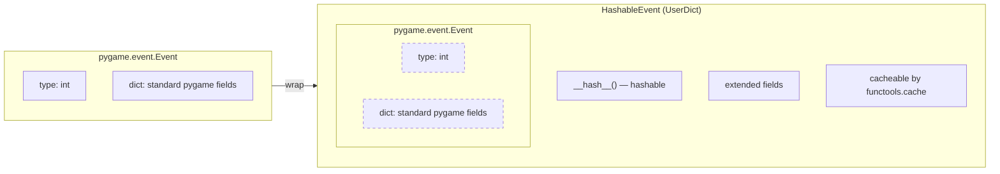

## Mouse Event Synthesis

The `MouseEventManager` synthesizes high-level drag, drop, and focus events
from primitive pygame mouse events. Button-specific variants are generated
for left, middle, and right buttons.

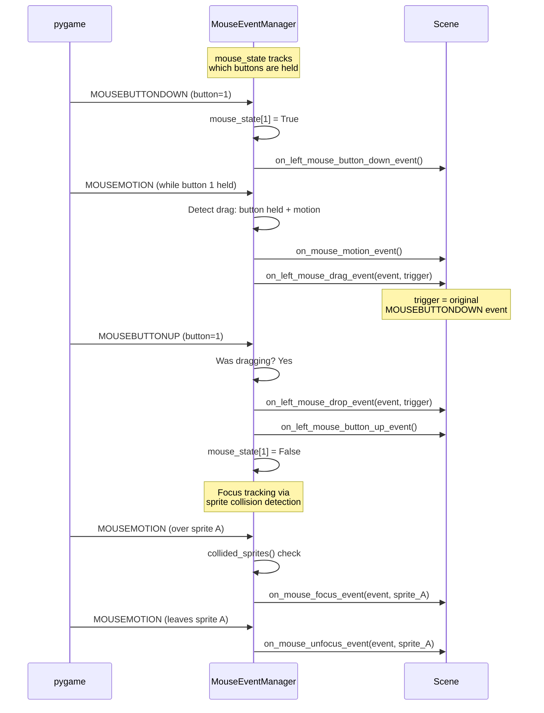

## Keyboard Chord Detection

The `KeyboardEventManager` tracks all currently pressed keys and emits
chord events, enabling multi-key shortcut detection.

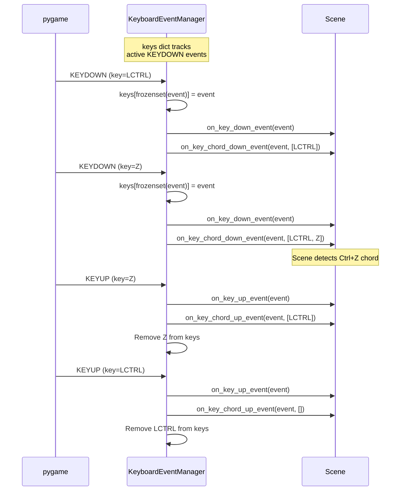

## Controller State Machine

The `ControllerEventManager` maintains per-controller state via inner proxy
objects. Each physical controller gets its own proxy identified by `instance_id`.

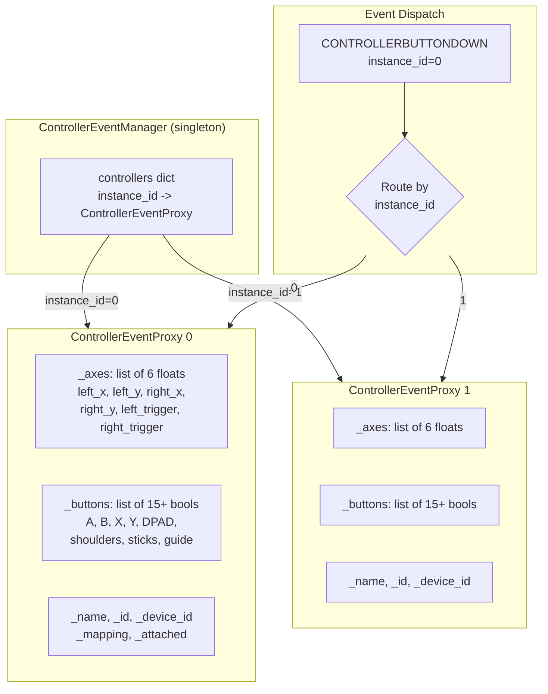

## Complete Event Category Map

All pygame event types organized by category, showing the mapping from SDL event
to GlitchyGames handler method. Each diagram shows SDL events on the left and the
`on_*_event()` handlers they produce on the right. Synthesized events (dashed
borders) are derived from primitive SDL events by the event managers.

The `event` parameter in every handler is a `HashableEvent` wrapping the original
SDL event — the same fields shown in the left box (e.g., `pos`, `button`, `key`)
are accessible as `event.pos`, `event.button`, `event.key`, etc. Synthesized
handlers may receive additional arguments beyond the event (noted in their
signatures).

### AudioEvents → AudioEventStubs

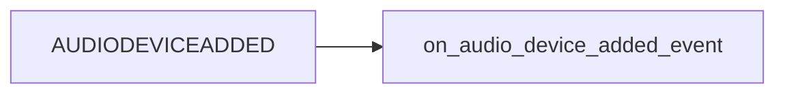

```py
def on_audio_device_added_event(
    event: HashableEvent(AUDIODEVICEADDED {
        'which': ...,
        'iscapture': ...,
    })
):
    ...
```

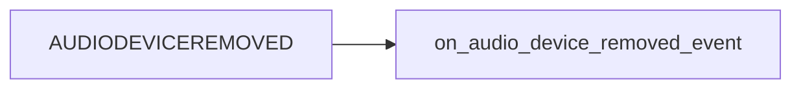

```py
def on_audio_device_removed_event(
    event: HashableEvent(AUDIODEVICEREMOVED {
        'which': ...,
        'iscapture': ...,
    })
):
    ...
```

### ControllerEvents → ControllerEventStubs

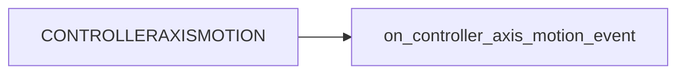

```py
def on_controller_axis_motion_event(
    event: HashableEvent(CONTROLLERAXISMOTION {
        'instance_id': ...,
        'axis': ...,
        'value': ...,
    })
):
    ...
```

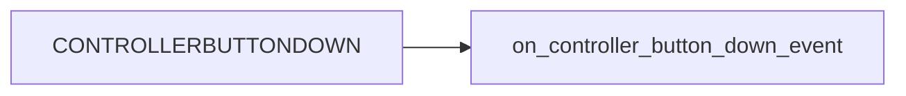

```py
def on_controller_button_down_event(
    event: HashableEvent(CONTROLLERBUTTONDOWN {
        'instance_id': ...,
        'button': ...,
    })
):
    ...
```

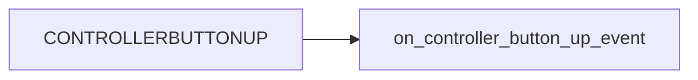

```py
def on_controller_button_up_event(
    event: HashableEvent(CONTROLLERBUTTONUP {
        'instance_id': ...,
        'button': ...,
    })
):
    ...
```

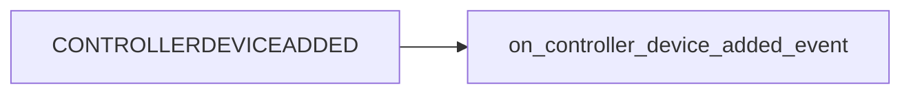

```py
def on_controller_device_added_event(
    event: HashableEvent(CONTROLLERDEVICEADDED {
        'device_index': ...,
        'guid': ...,
    })
):
    ...
```

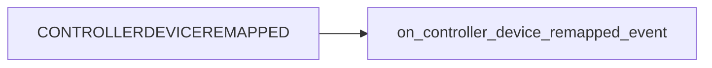

```py
def on_controller_device_remapped_event(
    event: HashableEvent(CONTROLLERDEVICEREMAPPED {
        'device_index': ...,
    })
):
    ...
```

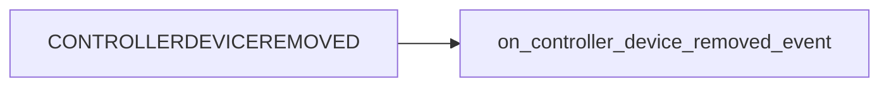

```py
def on_controller_device_removed_event(
    event: HashableEvent(CONTROLLERDEVICEREMOVED {
        'instance_id': ...,
    })
):
    ...
```


```py
def on_controller_touchpad_down_event(
    event: HashableEvent(CONTROLLERTOUCHPADDOWN {
        'instance_id': ...,
        'touchpad': ...,
        'finger': ...,
        'x': ...,
        'y': ...,
        'pressure': ...,
    })
):
    ...
```

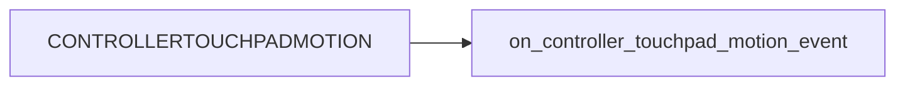

```py
def on_controller_touchpad_motion_event(
    event: HashableEvent(CONTROLLERTOUCHPADMOTION {
        'instance_id': ...,
        'touchpad': ...,
        'finger': ...,
        'x': ...,
        'y': ...,
        'pressure': ...,
    })
):
    ...
```

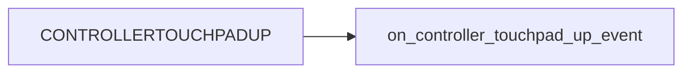

```py
def on_controller_touchpad_up_event(
    event: HashableEvent(CONTROLLERTOUCHPADUP {
        'instance_id': ...,
        'touchpad': ...,
        'finger': ...,
        'x': ...,
        'y': ...,
        'pressure': ...,
    })
):
    ...
```

### KeyboardEvents → KeyboardEventStubs

```mermaid
flowchart LR
    K1["KEYDOWN"] --> KH1["on_key_down_event"]
    click K1 "https://pyga.me/docs/ref/key.html" _blank
```

```py
def on_key_down_event(
    event: HashableEvent(KEYDOWN {
        'unicode': ...,
        'key': ...,
        'mod': ...,
        'scancode': ...,
    })
):
    ...
```

```mermaid
flowchart LR
    K2["KEYUP"] --> KH2["on_key_up_event"]
    click K2 "https://pyga.me/docs/ref/key.html" _blank
```

```py
def on_key_up_event(
    event: HashableEvent(KEYUP {
        'key': ...,
        'mod': ...,
        'scancode': ...,
    })
):
    ...
```

```mermaid
flowchart LR
    K1["KEYDOWN"] -.->|"tracks pressed keys"| KS1("on_key_chord_down_event"):::synthesized
    classDef synthesized stroke-dasharray: 5 5
    click K1 "https://pyga.me/docs/ref/key.html" _blank
```

```py
# Synthesized — fired after every KEYDOWN with all currently held keys
def on_key_chord_down_event(
    event: HashableEvent(KEYDOWN {
        'unicode': ..., 'key': ..., 'mod': ..., 'scancode': ...,
    }),
    keys: list,  # all keys currently held down
):
    ...
```

```mermaid
flowchart LR
    K2["KEYUP"] -.->|"tracks pressed keys"| KS2("on_key_chord_up_event"):::synthesized
    classDef synthesized stroke-dasharray: 5 5
    click K2 "https://pyga.me/docs/ref/key.html" _blank
```

```py
# Synthesized — fired after every KEYUP with all keys still held down
def on_key_chord_up_event(
    event: HashableEvent(KEYUP {
        'key': ..., 'mod': ..., 'scancode': ...,
    }),
    keys: list,  # all keys currently held down
):
    ...
```

### MouseEvents → MouseEventStubs

```mermaid
flowchart LR
    M1["MOUSEMOTION"] --> MH1["on_mouse_motion_event"]
    click M1 "https://pyga.me/docs/ref/mouse.html" _blank
```

```py
def on_mouse_motion_event(
    event: HashableEvent(MOUSEMOTION {
        'pos': ...,
        'rel': ...,
        'buttons': ...,
        'touch': ...,
    })
):
    ...
```

```mermaid
flowchart LR
    M2["MOUSEBUTTONDOWN"] --> MH2["on_mouse_button_down_event"]
    click M2 "https://pyga.me/docs/ref/mouse.html" _blank
```

```py
def on_mouse_button_down_event(
    event: HashableEvent(MOUSEBUTTONDOWN {
        'pos': ...,
        'button': ...,
        'touch': ...,
    })
):
    ...
```

```mermaid
flowchart LR
    M3["MOUSEBUTTONUP"] --> MH3["on_mouse_button_up_event"]
    click M3 "https://pyga.me/docs/ref/mouse.html" _blank
```

```py
def on_mouse_button_up_event(
    event: HashableEvent(MOUSEBUTTONUP {
        'pos': ...,
        'button': ...,
        'touch': ...,
    })
):
    ...
```

```mermaid
flowchart LR
    M4["MOUSEWHEEL"] --> MH4["on_mouse_wheel_event"]
    click M4 "https://pyga.me/docs/ref/mouse.html" _blank
```

```py
def on_mouse_wheel_event(
    event: HashableEvent(MOUSEWHEEL {
        'flipped': ...,
        'x': ...,
        'y': ...,
        'touch': ...,
        'window': ...,
    })
):
    ...
```

```mermaid
flowchart LR
    M2["MOUSEBUTTONDOWN"] -.->|"button==1"| MS1("on_left_mouse_button_down_event"):::synthesized
    M2 -.->|"button==2"| MS2("on_middle_mouse_button_down_event"):::synthesized
    M2 -.->|"button==3"| MS3("on_right_mouse_button_down_event"):::synthesized
    M2 -.->|"button==4"| MS4("on_mouse_scroll_down_event"):::synthesized
    M2 -.->|"button==5"| MS5("on_mouse_scroll_up_event"):::synthesized
    classDef synthesized stroke-dasharray: 5 5
    click M2 "https://pyga.me/docs/ref/mouse.html" _blank
```

```py
# Synthesized — button-specific variants of MOUSEBUTTONDOWN
def on_left_mouse_button_down_event(
    event: HashableEvent(MOUSEBUTTONDOWN {
        'pos': ..., 'button': ..., 'touch': ...,
    })
):
    ...

def on_middle_mouse_button_down_event(
    event: HashableEvent(MOUSEBUTTONDOWN {
        'pos': ..., 'button': ..., 'touch': ...,
    })
):
    ...

def on_right_mouse_button_down_event(
    event: HashableEvent(MOUSEBUTTONDOWN {
        'pos': ..., 'button': ..., 'touch': ...,
    })
):
    ...

def on_mouse_scroll_down_event(
    event: HashableEvent(MOUSEBUTTONDOWN {
        'pos': ..., 'button': ..., 'touch': ...,
    })
):
    ...

def on_mouse_scroll_up_event(
    event: HashableEvent(MOUSEBUTTONDOWN {
        'pos': ..., 'button': ..., 'touch': ...,
    })
):
    ...
```

```mermaid
flowchart LR
    M3["MOUSEBUTTONUP"] -.->|"button==1"| MS6("on_left_mouse_button_up_event"):::synthesized
    M3 -.->|"button==2"| MS7("on_middle_mouse_button_up_event"):::synthesized
    M3 -.->|"button==3"| MS8("on_right_mouse_button_up_event"):::synthesized
    classDef synthesized stroke-dasharray: 5 5
    click M3 "https://pyga.me/docs/ref/mouse.html" _blank
```

```py
# Synthesized — button-specific variants of MOUSEBUTTONUP
def on_left_mouse_button_up_event(
    event: HashableEvent(MOUSEBUTTONUP {
        'pos': ..., 'button': ..., 'touch': ...,
    })
):
    ...

def on_middle_mouse_button_up_event(
    event: HashableEvent(MOUSEBUTTONUP {
        'pos': ..., 'button': ..., 'touch': ...,
    })
):
    ...

def on_right_mouse_button_up_event(
    event: HashableEvent(MOUSEBUTTONUP {
        'pos': ..., 'button': ..., 'touch': ...,
    })
):
    ...
```

```mermaid
flowchart LR
    M1["MOUSEMOTION"] -.->|"button held + motion"| MS9("on_left_mouse_drag_event"):::synthesized
    M1 -.->|"button held + motion"| MS9b("on_middle_mouse_drag_event"):::synthesized
    M1 -.->|"button held + motion"| MS9c("on_right_mouse_drag_event"):::synthesized
    classDef synthesized stroke-dasharray: 5 5
    click M1 "https://pyga.me/docs/ref/mouse.html" _blank
```

```py
# Synthesized — drag events (motion while button held)
def on_left_mouse_drag_event(
    event: HashableEvent(MOUSEMOTION {
        'pos': ..., 'rel': ..., 'buttons': ..., 'touch': ...,
    }),
    trigger: HashableEvent(MOUSEBUTTONDOWN {
        'pos': ..., 'button': ..., 'touch': ...,
    }),  # the original button-down
):
    ...

def on_middle_mouse_drag_event(
    event: HashableEvent(MOUSEMOTION {
        'pos': ..., 'rel': ..., 'buttons': ..., 'touch': ...,
    }),
    trigger: HashableEvent(MOUSEBUTTONDOWN {
        'pos': ..., 'button': ..., 'touch': ...,
    }),
):
    ...

def on_right_mouse_drag_event(
    event: HashableEvent(MOUSEMOTION {
        'pos': ..., 'rel': ..., 'buttons': ..., 'touch': ...,
    }),
    trigger: HashableEvent(MOUSEBUTTONDOWN {
        'pos': ..., 'button': ..., 'touch': ...,
    }),
):
    ...
```

```mermaid
flowchart LR
    M3["MOUSEBUTTONUP"] -.->|"released after drag"| MS10("on_left_mouse_drop_event"):::synthesized
    M3 -.->|"released after drag"| MS10b("on_middle_mouse_drop_event"):::synthesized
    M3 -.->|"released after drag"| MS10c("on_right_mouse_drop_event"):::synthesized
    classDef synthesized stroke-dasharray: 5 5
    click M3 "https://pyga.me/docs/ref/mouse.html" _blank
```

```py
# Synthesized — drop events (button released after drag)
def on_left_mouse_drop_event(
    event: HashableEvent(MOUSEBUTTONUP {
        'pos': ..., 'button': ..., 'touch': ...,
    }),
    trigger: HashableEvent(MOUSEBUTTONDOWN {
        'pos': ..., 'button': ..., 'touch': ...,
    }),  # the original button-down
):
    ...

def on_middle_mouse_drop_event(
    event: HashableEvent(MOUSEBUTTONUP {
        'pos': ..., 'button': ..., 'touch': ...,
    }),
    trigger: HashableEvent(MOUSEBUTTONDOWN {
        'pos': ..., 'button': ..., 'touch': ...,
    }),
):
    ...

def on_right_mouse_drop_event(
    event: HashableEvent(MOUSEBUTTONUP {
        'pos': ..., 'button': ..., 'touch': ...,
    }),
    trigger: HashableEvent(MOUSEBUTTONDOWN {
        'pos': ..., 'button': ..., 'touch': ...,
    }),
):
    ...
```

```mermaid
flowchart LR
    M1["MOUSEMOTION"] -.->|"sprite collision change"| MS11("on_mouse_focus_event"):::synthesized
    M1 -.->|"sprite collision change"| MS12("on_mouse_unfocus_event"):::synthesized
    classDef synthesized stroke-dasharray: 5 5
    click M1 "https://pyga.me/docs/ref/mouse.html" _blank
```

```py
# Synthesized — sprite focus tracking
def on_mouse_focus_event(
    event: HashableEvent(MOUSEMOTION {
        'pos': ..., 'rel': ..., 'buttons': ..., 'touch': ...,
    }),
    entering_focus: object,  # the sprite gaining focus
):
    ...

def on_mouse_unfocus_event(
    event: HashableEvent(MOUSEMOTION {
        'pos': ..., 'rel': ..., 'buttons': ..., 'touch': ...,
    }),
    leaving_focus: object,  # the sprite losing focus
):
    ...
```

### JoystickEvents → JoystickEventStubs

```mermaid
flowchart LR
    J1["JOYAXISMOTION"] --> JH1["on_joy_axis_motion_event"]
    click J1 "https://pyga.me/docs/ref/joystick.html" _blank
```

```py
def on_joy_axis_motion_event(
    event: HashableEvent(JOYAXISMOTION {
        'joy': ...,
        'instance_id': ...,
        'axis': ...,
        'value': ...,
    })
):
    ...
```

```mermaid
flowchart LR
    J2["JOYBUTTONDOWN"] --> JH2["on_joy_button_down_event"]
    click J2 "https://pyga.me/docs/ref/joystick.html" _blank
```

```py
def on_joy_button_down_event(
    event: HashableEvent(JOYBUTTONDOWN {
        'joy': ...,
        'instance_id': ...,
        'button': ...,
    })
):
    ...
```

```mermaid
flowchart LR
    J3["JOYBUTTONUP"] --> JH3["on_joy_button_up_event"]
    click J3 "https://pyga.me/docs/ref/joystick.html" _blank
```

```py
def on_joy_button_up_event(
    event: HashableEvent(JOYBUTTONUP {
        'joy': ...,
        'instance_id': ...,
        'button': ...,
    })
):
    ...
```

```mermaid
flowchart LR
    J4["JOYHATMOTION"] --> JH4["on_joy_hat_motion_event"]
    click J4 "https://pyga.me/docs/ref/joystick.html" _blank
```

```py
def on_joy_hat_motion_event(
    event: HashableEvent(JOYHATMOTION {
        'joy': ...,
        'instance_id': ...,
        'hat': ...,
        'value': ...,
    })
):
    ...
```

```mermaid
flowchart LR
    J5["JOYBALLMOTION"] --> JH5["on_joy_ball_motion_event"]
    click J5 "https://pyga.me/docs/ref/joystick.html" _blank
```

```py
def on_joy_ball_motion_event(
    event: HashableEvent(JOYBALLMOTION {
        'joy': ...,
        'instance_id': ...,
        'ball': ...,
        'rel': ...,
    })
):
    ...
```

```mermaid
flowchart LR
    J6["JOYDEVICEADDED"] --> JH6["on_joy_device_added_event"]
    click J6 "https://pyga.me/docs/ref/joystick.html" _blank
```

```py
def on_joy_device_added_event(
    event: HashableEvent(JOYDEVICEADDED {
        'device_index': ...,
        'guid': ...,
    })
):
    ...
```

```mermaid
flowchart LR
    J7["JOYDEVICEREMOVED"] --> JH7["on_joy_device_removed_event"]
    click J7 "https://pyga.me/docs/ref/joystick.html" _blank
```

```py
def on_joy_device_removed_event(
    event: HashableEvent(JOYDEVICEREMOVED {
        'instance_id': ...,
    })
):
    ...
```

### WindowEvents → WindowEventStubs

All window events carry `{'window': ...}` (the window ID).
WINDOWRESIZED, WINDOWMOVED, and WINDOWSIZECHANGED also carry `{'x': ..., 'y': ...}`.

```mermaid
flowchart LR
    W1["WINDOWCLOSE"] --> WH1["on_window_close_event"]
    click W1 "https://pyga.me/docs/ref/window.html" _blank
```

```py
def on_window_close_event(event: HashableEvent(WINDOWCLOSE {'window': ...})):
    ...
```

```mermaid
flowchart LR
    W2["WINDOWFOCUSGAINED"] --> WH2["on_window_focus_gained_event"]
    click W2 "https://pyga.me/docs/ref/window.html" _blank
```

```py
def on_window_focus_gained_event(event: HashableEvent(WINDOWFOCUSGAINED {'window': ...})):
    ...
```

```mermaid
flowchart LR
    W3["WINDOWFOCUSLOST"] --> WH3["on_window_focus_lost_event"]
    click W3 "https://pyga.me/docs/ref/window.html" _blank
```

```py
def on_window_focus_lost_event(event: HashableEvent(WINDOWFOCUSLOST {'window': ...})):
    ...
```

```mermaid
flowchart LR
    W4["WINDOWRESIZED"] --> WH4["on_window_resized_event"]
    click W4 "https://pyga.me/docs/ref/window.html" _blank
```

```py
def on_window_resized_event(event: HashableEvent(WINDOWRESIZED {'window': ..., 'x': ..., 'y': ...})):
    ...
```

```mermaid
flowchart LR
    W5["WINDOWMOVED"] --> WH5["on_window_moved_event"]
    click W5 "https://pyga.me/docs/ref/window.html" _blank
```

```py
def on_window_moved_event(event: HashableEvent(WINDOWMOVED {'window': ..., 'x': ..., 'y': ...})):
    ...
```

```mermaid
flowchart LR
    W6["WINDOWMINIMIZED"] --> WH6["on_window_minimized_event"]
    click W6 "https://pyga.me/docs/ref/window.html" _blank
```

```py
def on_window_minimized_event(event: HashableEvent(WINDOWMINIMIZED {'window': ...})):
    ...
```

```mermaid
flowchart LR
    W7["WINDOWMAXIMIZED"] --> WH7["on_window_maximized_event"]
    click W7 "https://pyga.me/docs/ref/window.html" _blank
```

```py
def on_window_maximized_event(event: HashableEvent(WINDOWMAXIMIZED {'window': ...})):
    ...
```

```mermaid
flowchart LR
    W8["WINDOWRESTORED"] --> WH8["on_window_restored_event"]
    click W8 "https://pyga.me/docs/ref/window.html" _blank
```

```py
def on_window_restored_event(event: HashableEvent(WINDOWRESTORED {'window': ...})):
    ...
```

```mermaid
flowchart LR
    W9["WINDOWSHOWN"] --> WH9["on_window_shown_event"]
    click W9 "https://pyga.me/docs/ref/window.html" _blank
```

```py
def on_window_shown_event(event: HashableEvent(WINDOWSHOWN {'window': ...})):
    ...
```

```mermaid
flowchart LR
    W10["WINDOWHIDDEN"] --> WH10["on_window_hidden_event"]
    click W10 "https://pyga.me/docs/ref/window.html" _blank
```

```py
def on_window_hidden_event(event: HashableEvent(WINDOWHIDDEN {'window': ...})):
    ...
```

```mermaid
flowchart LR
    W11["WINDOWEXPOSED"] --> WH11["on_window_exposed_event"]
    click W11 "https://pyga.me/docs/ref/window.html" _blank
```

```py
def on_window_exposed_event(event: HashableEvent(WINDOWEXPOSED {'window': ...})):
    ...
```

```mermaid
flowchart LR
    W12["WINDOWENTER"] --> WH12["on_window_enter_event"]
    click W12 "https://pyga.me/docs/ref/window.html" _blank
```

```py
def on_window_enter_event(event: HashableEvent(WINDOWENTER {'window': ...})):
    ...
```

```mermaid
flowchart LR
    W13["WINDOWLEAVE"] --> WH13["on_window_leave_event"]
    click W13 "https://pyga.me/docs/ref/window.html" _blank
```

```py
def on_window_leave_event(event: HashableEvent(WINDOWLEAVE {'window': ...})):
    ...
```

```mermaid
flowchart LR
    W14["WINDOWSIZECHANGED"] --> WH14["on_window_size_changed_event"]
    click W14 "https://pyga.me/docs/ref/window.html" _blank
```

```py
def on_window_size_changed_event(event: HashableEvent(WINDOWSIZECHANGED {'window': ..., 'x': ..., 'y': ...})):
    ...
```

```mermaid
flowchart LR
    W15["WINDOWTAKEFOCUS"] --> WH15["on_window_take_focus_event"]
    click W15 "https://pyga.me/docs/ref/window.html" _blank
```

```py
def on_window_take_focus_event(event: HashableEvent(WINDOWTAKEFOCUS {'window': ...})):
    ...
```

### DropEvents → DropEventStubs

```mermaid
flowchart LR
    D1["DROPBEGIN"] --> DH1["on_drop_begin_event"]
    click D1 "https://pyga.me/docs/ref/event.html" _blank
```

```py
def on_drop_begin_event(
    event: HashableEvent(DROPBEGIN)
):
    ...
```

```mermaid
flowchart LR
    D2["DROPFILE"] --> DH2["on_drop_file_event"]
    click D2 "https://pyga.me/docs/ref/event.html" _blank
```

```py
def on_drop_file_event(
    event: HashableEvent(DROPFILE {
        'file': ...,
    })
):
    ...
```

```mermaid
flowchart LR
    D3["DROPTEXT"] --> DH3["on_drop_text_event"]
    click D3 "https://pyga.me/docs/ref/event.html" _blank
```

```py
def on_drop_text_event(
    event: HashableEvent(DROPTEXT {
        'text': ...,
    })
):
    ...
```

```mermaid
flowchart LR
    D4["DROPCOMPLETE"] --> DH4["on_drop_complete_event"]
    click D4 "https://pyga.me/docs/ref/event.html" _blank
```

```py
def on_drop_complete_event(
    event: HashableEvent(DROPCOMPLETE)
):
    ...
```

### TouchEvents → TouchEventStubs

```mermaid
flowchart LR
    T1["FINGERDOWN"] --> TH1["on_touch_down_event"]
    click T1 "https://pyga.me/docs/ref/touch.html" _blank
```

```py
def on_touch_down_event(
    event: HashableEvent(FINGERDOWN {
        'touch_id': ...,
        'finger_id': ...,
        'x': ...,
        'y': ...,
        'dx': ...,
        'dy': ...,
        'pressure': ...,
    })
):
    ...
```

```mermaid
flowchart LR
    T2["FINGERMOTION"] --> TH2["on_touch_motion_event"]
    click T2 "https://pyga.me/docs/ref/touch.html" _blank
```

```py
def on_touch_motion_event(
    event: HashableEvent(FINGERMOTION {
        'touch_id': ...,
        'finger_id': ...,
        'x': ...,
        'y': ...,
        'dx': ...,
        'dy': ...,
        'pressure': ...,
    })
):
    ...
```

```mermaid
flowchart LR
    T3["FINGERUP"] --> TH3["on_touch_up_event"]
    click T3 "https://pyga.me/docs/ref/touch.html" _blank
```

```py
def on_touch_up_event(
    event: HashableEvent(FINGERUP {
        'touch_id': ...,
        'finger_id': ...,
        'x': ...,
        'y': ...,
        'dx': ...,
        'dy': ...,
        'pressure': ...,
    })
):
    ...
```

```mermaid
flowchart LR
    T4["MULTIGESTURE"] --> TH4["on_multi_touch_*_event"]
    click T4 "https://pyga.me/docs/ref/touch.html" _blank
```

```py
def on_multi_touch_*_event(
    event: HashableEvent(MULTIGESTURE {
        'touch_id': ...,
        'x': ...,
        'y': ...,
        'pinched': ...,
        'rotated': ...,
        'num_fingers': ...,
    })
):
    ...
```

### GameEvents → GameEventStubs

```mermaid
flowchart LR
    G1["FPSEVENT"] --> GH1["on_fps_event"]
    click G1 "https://pyga.me/docs/ref/event.html" _blank
```

```py
# Custom USEREVENT+1 — payload is game-defined
def on_fps_event(
    event: HashableEvent(FPSEVENT {...})
):
    ...
```

```mermaid
flowchart LR
    G2["GAMEEVENT"] --> GH2["on_game_event"]
    click G2 "https://pyga.me/docs/ref/event.html" _blank
```

```py
# Custom USEREVENT+2 — payload is game-defined
def on_game_event(
    event: HashableEvent(GAMEEVENT {...})
):
    ...
```

```mermaid
flowchart LR
    G3["MENUEVENT"] --> GH3["on_menu_item_event"]
    click G3 "https://pyga.me/docs/ref/event.html" _blank
```

```py
# Custom USEREVENT+3 — payload is game-defined
def on_menu_item_event(
    event: HashableEvent(MENUEVENT {...})
):
    ...
```

```mermaid
flowchart LR
    G4["QUIT"] --> GH4["on_quit_event"]
    click G4 "https://pyga.me/docs/ref/event.html" _blank
```

```py
def on_quit_event(
    event: HashableEvent(QUIT)
):
    ...
```

```mermaid
flowchart LR
    G5["ACTIVEEVENT"] --> GH5["on_active_event"]
    click G5 "https://pyga.me/docs/ref/event.html" _blank
```

```py
def on_active_event(
    event: HashableEvent(ACTIVEEVENT {
        'gain': ...,
        'state': ...,
    })
):
    ...
```

```mermaid
flowchart LR
    G6["VIDEORESIZE"] --> GH6["on_video_resize_event"]
    click G6 "https://pyga.me/docs/ref/event.html" _blank
```

```py
def on_video_resize_event(
    event: HashableEvent(VIDEORESIZE {
        'size': ...,
        'w': ...,
        'h': ...,
    })
):
    ...
```

```mermaid
flowchart LR
    G7["CLIPBOARDUPDATE"] --> GH7["on_clipboard_update_event"]
    click G7 "https://pyga.me/docs/ref/event.html" _blank
```

```py
def on_clipboard_update_event(
    event: HashableEvent(CLIPBOARDUPDATE)
):
    ...
```

### AppEvents → AppEventStubs

All app lifecycle events carry no parameters.

```mermaid
flowchart LR
    A1["APP_TERMINATING"] --> AH1["on_app_terminating_event"]
    click A1 "https://pyga.me/docs/ref/event.html" _blank
```

```py
def on_app_terminating_event(event: HashableEvent(APP_TERMINATING)):
    ...
```

```mermaid
flowchart LR
    A2["APP_LOWMEMORY"] --> AH2["on_app_low_memory_event"]
    click A2 "https://pyga.me/docs/ref/event.html" _blank
```

```py
def on_app_low_memory_event(event: HashableEvent(APP_LOWMEMORY)):
    ...
```

```mermaid
flowchart LR
    A3["APP_WILLENTERBACKGROUND"] --> AH3["on_app_will_enter_background_event"]
    click A3 "https://pyga.me/docs/ref/event.html" _blank
```

```py
def on_app_will_enter_background_event(event: HashableEvent(APP_WILLENTERBACKGROUND)):
    ...
```

```mermaid
flowchart LR
    A4["APP_DIDENTERBACKGROUND"] --> AH4["on_app_did_enter_background_event"]
    click A4 "https://pyga.me/docs/ref/event.html" _blank
```

```py
def on_app_did_enter_background_event(event: HashableEvent(APP_DIDENTERBACKGROUND)):
    ...
```

```mermaid
flowchart LR
    A5["APP_WILLENTERFOREGROUND"] --> AH5["on_app_will_enter_foreground_event"]
    click A5 "https://pyga.me/docs/ref/event.html" _blank
```

```py
def on_app_will_enter_foreground_event(event: HashableEvent(APP_WILLENTERFOREGROUND)):
    ...
```

```mermaid
flowchart LR
    A6["APP_DIDENTERFOREGROUND"] --> AH6["on_app_did_enter_foreground_event"]
    click A6 "https://pyga.me/docs/ref/event.html" _blank
```

```py
def on_app_did_enter_foreground_event(event: HashableEvent(APP_DIDENTERFOREGROUND)):
    ...
```

### Text Events (no dedicated stubs)

```mermaid
flowchart LR
    TX1["TEXTEDITING"] --> TXH1["on_text_editing_event"]
    click TX1 "https://pyga.me/docs/ref/event.html" _blank
```

```py
def on_text_editing_event(
    event: HashableEvent(TEXTEDITING {
        'text': ...,
        'start': ...,
        'length': ...,
    })
):
    ...
```

```mermaid
flowchart LR
    TX2["TEXTINPUT"] --> TXH2["on_text_input_event"]
    click TX2 "https://pyga.me/docs/ref/event.html" _blank
```

```py
def on_text_input_event(
    event: HashableEvent(TEXTINPUT {
        'text': ...,
    })
):
    ...
```

### MidiEvents → MidiEventStubs

```mermaid
flowchart LR
    MI1["MIDIIN"] --> MIH1["on_midi_in_event"]
    click MI1 "https://pyga.me/docs/ref/midi.html" _blank
```

```py
def on_midi_in_event(
    event: HashableEvent(MIDIIN {
        'device_id': ...,
        'status': ...,
        'data1': ...,
        'data2': ...,
    })
):
    ...
```

```mermaid
flowchart LR
    MI2["MIDIOUT"] --> MIH2["on_midi_out_event"]
    click MI2 "https://pyga.me/docs/ref/midi.html" _blank
```

```py
def on_midi_out_event(
    event: HashableEvent(MIDIOUT {
        'device_id': ...,
        'status': ...,
        'data1': ...,
        'data2': ...,
    })
):
    ...
```

## Joystick vs Controller: Two Input Subsystems

GlitchyGames supports two distinct SDL input subsystems for gamepads:
**Joystick** (low-level) and **Controller** (high-level). They coexist because
they serve different needs, and some devices only work with one or the other.

### Why two subsystems?

| | Joystick (`pygame.joystick`) | Controller (`pygame._sdl2.controller`) |
|---|---|---|
| **Abstraction level** | Raw hardware — axes, buttons, hats, balls are numbered | Semantic — A/B/X/Y, D-pad, triggers, thumbsticks by name |
| **Device support** | Everything SDL recognizes as a joystick | Only devices with an SDL GameController mapping |
| **Button/axis identity** | Button 0, Axis 2 (meaning varies by device) | `CONTROLLER_BUTTON_A`, `CONTROLLER_AXIS_LEFTX` (consistent) |
| **Mapping** | None — raw hardware indices | SDL's built-in GameController DB maps hardware to semantic names |
| **Hotplug ID** | `device_index` (unstable) + `instance_id` (stable) | `device_index` (see pygame bug note below) |
| **Touchpad support** | No | Yes (CONTROLLERTOUCHPAD* events) |
| **Remapping events** | No | Yes (CONTROLLERDEVICEREMAPPED) |

Games can choose one or both via `--input-mode joystick|controller`. The
joystick demo supports both modes and displays different information for each.

!!! warning "Disabling joystick events disables controller events"
    SDL's GameController API is built on top of the joystick subsystem. If you
    call `pygame.event.set_blocked()` on joystick event types (`JOYAXISMOTION`,
    `JOYBUTTONDOWN`, etc.), SDL will also stop delivering the corresponding
    controller events (`CONTROLLERAXISMOTION`, `CONTROLLERBUTTONDOWN`, etc.).
    If you need controllers but not raw joysticks, leave the joystick events
    unblocked and simply don't implement joystick handlers — the cached stubs
    will handle them at near-zero cost.

### JoystickEventManager architecture

Unlike other event managers, `JoystickEventManager` manages **multiple proxy
objects** — one per connected joystick. The outer manager is still a singleton,
but it maintains a `self.joysticks` dict keyed by `instance_id`, and routes each
event to the correct proxy based on the event's joystick identity.

This is necessary because:

1. **Multiple devices**: There can be 1–N joysticks connected simultaneously.
   Other managers (Mouse, Keyboard) handle a single global device.
2. **Per-device state**: Each joystick has its own axis values, button states,
   hat positions, and trackball deltas. These must be tracked independently.
3. **ID instability**: SDL's `device_index` can change when devices are
   added/removed. The manager uses `instance_id` (stable for the lifetime of
   a connection) as the dict key instead.

#### Cached properties

The proxy caches several joystick properties at init time because some hardware
has **extremely slow flash reads** for metadata queries. Calling `get_name()` on
certain joysticks can take hundreds of milliseconds — unacceptable in a game
loop. The cached values are:

- `_name` — joystick name string (primary motivation for caching)
- `_guid` — hardware GUID
- `_init` — initialization status
- `_power_level` — battery level (if supported)
- `_numaxes`, `_numballs`, `_numbuttons`, `_numhats` — capability counts

The proxy exposes `get_name()`, `get_numaxes()`, etc. methods that return the
cached values, matching the `pygame.joystick.Joystick` API so the proxy is a
drop-in substitute.

#### Event routing

```mermaid
flowchart TD
    EVT["SDL Joystick Event\n(JOYAXISMOTION, etc.)"] --> MGR["JoystickEventManager\n(singleton)"]
    MGR --> RESOLVE{"Resolve joystick\ninstance_id from event"}
    RESOLVE -->|"event.instance_id\nor fallback event.joy"| LOOKUP["self.joysticks[instance_id]"]
    LOOKUP --> PROXY["JoystickEventProxy #N"]
    PROXY --> STATE["Update cached state\n(_axes, _buttons, _hats, _balls)"]
    STATE --> GAME["Forward to self.game\non_joy_*_event()"]

    ADD["JOYDEVICEADDED"] --> MGR2["JoystickEventManager"]
    MGR2 --> CREATE["Create new JoystickEventProxy\n(init joystick, cache properties)"]
    CREATE --> DICT["self.joysticks[instance_id] = proxy"]
    DICT --> NOTIFY["proxy.on_joy_device_added_event()"]

    REM["JOYDEVICEREMOVED"] --> MGR3["JoystickEventManager"]
    MGR3 --> CLEANUP["Notify proxy, then\nself.joysticks.pop(instance_id)"]
```

### ControllerEventManager architecture

`ControllerEventManager` follows the same multi-proxy pattern as Joystick — one
`ControllerEventProxy` per connected controller, keyed by ID in
`self.controllers`. The key differences:

1. **SDL GameController API**: Uses `pygame._sdl2.controller` instead of
   `pygame.joystick`. This provides semantic button/axis names (A, B, X, Y,
   left trigger, etc.) instead of raw hardware indices.
2. **Fixed axis/button sets**: Controller proxies define `AXIS` and `BUTTONS`
   class variables with the standard SDL GameController constants. The proxy
   still allows dynamic growth for non-standard buttons.
3. **Touchpad events**: Controllers support `CONTROLLERTOUCHPADDOWN`,
   `CONTROLLERTOUCHPADMOTION`, and `CONTROLLERTOUCHPADUP` — events that have
   no joystick equivalent.
4. **Remapping**: `CONTROLLERDEVICEREMAPPED` fires when SDL updates a
   controller's button mapping at runtime. No joystick equivalent.
5. **No caching needed**: The SDL GameController API doesn't suffer from the
   slow flash-read problem that raw joysticks have, so controller names and
   metadata are queried directly.
6. **Pygame bug**: Hotplugged controllers can end up with incorrect
   `device_index` values due to a pygame-ce bug. The manager works around this
   by creating new proxies on `CONTROLLERDEVICEADDED` using the event's
   `device_index`.

#### Event routing

```mermaid
flowchart TD
    EVT["SDL Controller Event\n(CONTROLLERBUTTONDOWN, etc.)"] --> MGR["ControllerEventManager\n(singleton)"]
    MGR --> LOOKUP["self.controllers[event.instance_id]"]
    LOOKUP --> PROXY["ControllerEventProxy #N"]
    PROXY --> STATE["Update state\n(_axes, _buttons)"]
    STATE --> GAME["Forward to self.game\non_controller_*_event()"]

    ADD["CONTROLLERDEVICEADDED"] --> MGR2["ControllerEventManager"]
    MGR2 --> CHECK{"is_controller(device_index)?"}
    CHECK -->|"Yes"| CREATE["Create ControllerEventProxy\n(init SDL GameController)"]
    CHECK -->|"No"| SKIP["Log warning, skip"]
    CREATE --> DICT["self.controllers[device_index] = proxy"]

    REM["CONTROLLERDEVICEREMOVED"] --> MGR3["ControllerEventManager"]
    MGR3 --> CLEANUP["Notify proxy, then\ndel self.controllers[instance_id]"]
```

### Joystick state tracking

Each `JoystickEventProxy` maintains cached arrays for every input on its device.
Events update these arrays so game code can poll current state without querying
the hardware or reaching into pygame internals.

#### Button state

Buttons are tracked as a `list[bool]`. The list grows dynamically if a device
reports a button index beyond the initially detected count.

```mermaid
stateDiagram-v2
    [*] --> Released : init#58; get_button#40;i#41;
    Released --> Pressed : JOYBUTTONDOWN
    Pressed --> Released : JOYBUTTONUP

    state Released {
        [*] : _buttons[i] = False
    }
    state Pressed {
        [*] : _buttons[i] = True
    }
```

```py
# Proxy state update on JOYBUTTONDOWN
if event.button >= len(self._buttons):
    self._buttons.extend([False] * (event.button + 1 - len(self._buttons)))
self._buttons[event.button] = True

# Proxy state update on JOYBUTTONUP
self._buttons[event.button] = False
```

#### Axis state

Axes are tracked as a `list[float]`. Each axis value ranges from -1.0 to 1.0.

```mermaid
stateDiagram-v2
    [*] --> Idle : init#58; get_axis#40;i#41;
    Idle --> Updated : JOYAXISMOTION
    Updated --> Updated : JOYAXISMOTION

    state Idle {
        [*] : _axes[i] = 0.0
    }
    state Updated {
        [*] : _axes[i] = event.value, range -1.0 to 1.0
    }
```

```py
# Proxy state update on JOYAXISMOTION
self._axes[event.axis] = event.value
```

#### Hat state

Hats (D-pads) are tracked as a `list[tuple[int, int]]`. Each value is an
`(x, y)` pair where x and y are -1, 0, or 1.

```mermaid
stateDiagram-v2
    [*] --> Centered : init#58; get_hat#40;i#41;
    Centered --> Pressed : JOYHATMOTION
    Pressed --> Pressed : JOYHATMOTION
    Pressed --> Centered : JOYHATMOTION value 0,0

    state Centered {
        [*] : _hats[i] = 0, 0
    }
    state Pressed {
        [*] : _hats[i] = tuple x,y where each is -1, 0, or 1
    }
```

```py
# Proxy state update on JOYHATMOTION
self._hats[event.hat] = event.value  # (x, y) tuple
```

#### Trackball state

Trackballs are tracked as a `list[tuple[float, float]]` storing relative motion
deltas since the last event.

```py
# Proxy state update on JOYBALLMOTION
self._balls[event.ball] = event.rel  # (dx, dy) tuple
```

### Controller state tracking

Controllers use the same button and axis state tracking as joysticks, but with
SDL GameController semantics — buttons and axes have fixed semantic identities
rather than raw hardware indices.

#### Controller button state

Identical to joystick buttons, but the indices map to SDL GameController
constants (`CONTROLLER_BUTTON_A`, `CONTROLLER_BUTTON_B`, etc.). The list grows
dynamically for non-standard buttons.

```mermaid
stateDiagram-v2
    [*] --> Released : init#58; get_button#40;i#41;
    Released --> Pressed : CONTROLLERBUTTONDOWN
    Pressed --> Released : CONTROLLERBUTTONUP

    state Released {
        [*] : _buttons[i] = False
    }
    state Pressed {
        [*] : _buttons[i] = True
    }
```

```py
# Standard SDL GameController button constants
BUTTONS = [
    CONTROLLER_BUTTON_A,      CONTROLLER_BUTTON_B,
    CONTROLLER_BUTTON_X,      CONTROLLER_BUTTON_Y,
    CONTROLLER_BUTTON_DPAD_UP, CONTROLLER_BUTTON_DPAD_DOWN,
    CONTROLLER_BUTTON_DPAD_LEFT, CONTROLLER_BUTTON_DPAD_RIGHT,
    CONTROLLER_BUTTON_LEFTSHOULDER, CONTROLLER_BUTTON_RIGHTSHOULDER,
    CONTROLLER_BUTTON_LEFTSTICK, CONTROLLER_BUTTON_RIGHTSTICK,
    CONTROLLER_BUTTON_BACK, CONTROLLER_BUTTON_GUIDE, CONTROLLER_BUTTON_START,
]
```

#### Controller axis state

Six fixed axes with semantic names. Values range from -32768 to 32767 for
sticks, 0 to 32767 for triggers.

```mermaid
stateDiagram-v2
    [*] --> Idle : init#58; get_axis#40;i#41;
    Idle --> Updated : CONTROLLERAXISMOTION
    Updated --> Updated : CONTROLLERAXISMOTION

    state Idle {
        [*] : _axes[i] = 0
    }
    state Updated {
        [*] : _axes[i] = event.value
    }
```

```py
# Standard SDL GameController axis constants
AXIS = [
    CONTROLLER_AXIS_LEFTX,       CONTROLLER_AXIS_LEFTY,
    CONTROLLER_AXIS_RIGHTX,      CONTROLLER_AXIS_RIGHTY,
    CONTROLLER_AXIS_TRIGGERLEFT, CONTROLLER_AXIS_TRIGGERRIGHT,
]
```

## Unhandled Event Safety Net

When an event has no handler, the stub system catches it. The behavior is
configurable: silent, logged, or error-raising (used in tests).

```mermaid
flowchart TD
    EVENT["Event arrives at\non_*_event() stub"] --> CACHED{"@functools.cache\nalready seen?"}
    CACHED -->|"Yes"| SKIP["Return cached result\nno duplicate warnings"]
    CACHED -->|"No"| UH["unhandled_event()"]
    UH --> CHECK_DEBUG{"options.debug_events?"}
    CHECK_DEBUG -->|"Yes"| LOG_D["Log event details\nat DEBUG level"]
    CHECK_DEBUG -->|"No"| CHECK_STRICT{"options.no_unhandled_events?"}
    CHECK_STRICT -->|"Yes"| RAISE["Raise UnhandledEventError\n(used in test suite)"]
    CHECK_STRICT -->|"No"| LOG_W["Log warning\nfirst occurrence only"]
```

## Scene Manager Event Forwarding

The `SceneManager` implements every event handler method and forwards to the
`active_scene`. This provides the indirection layer that enables scene switching
without rewiring event handlers.

```mermaid
flowchart LR
    subgraph Managers["Event Managers"]
        AM["AudioEventManager"]
        CM["ControllerEventManager"]
        KM["KeyboardEventManager"]
        MM["MouseEventManager"]
        JM["JoystickEventManager"]
        WM["WindowEventManager"]
        GM["GameEventManager"]
        DM["DropEventManager"]
        TM["TouchEventManager"]
    end

    subgraph SM["SceneManager (singleton)"]
        FWD["Forwards all on_*_event()\ncalls to active_scene"]
        AS["active_scene reference"]
    end

    AM & CM & KM & MM & JM & WM & GM & DM & TM --> FWD
    FWD --> AS
    AS --> SCENE["Active Scene\non_*_event()"]
```

### Scene transitions in Bitmappy

The `active_scene` pointer determines which scene receives all events. When a
scene calls `switch_to_scene(next_scene)`, the SceneManager:

1. Calls `cleanup()` on the current scene
2. Calls `setup()` on the next scene
3. Updates `active_scene` to point to the next scene
4. All subsequent events flow to the new scene

The following diagram shows what user actions trigger each scene transition
in the Bitmappy pixel art editor:

```mermaid
stateDiagram-v2
    [*] --> BitmapEditorScene : GameEngine.start()

    BitmapEditorScene --> LoadDialogScene : User opens File > Load
    BitmapEditorScene --> SaveDialogScene : User opens File > Save
    BitmapEditorScene --> NewCanvasDialogScene : User opens File > New
    BitmapEditorScene --> DeleteFrameDialog : User clicks delete frame
    BitmapEditorScene --> DeleteAnimationDialog : User clicks delete animation
    BitmapEditorScene --> PauseScene : User presses Escape
    BitmapEditorScene --> GameOverScene : Game calls game_over()

    LoadDialogScene --> BitmapEditorScene : User confirms or cancels
    SaveDialogScene --> BitmapEditorScene : User confirms or cancels
    NewCanvasDialogScene --> BitmapEditorScene : User confirms or cancels
    DeleteFrameDialog --> BitmapEditorScene : User confirms or cancels
    DeleteAnimationDialog --> BitmapEditorScene : User confirms or cancels
    PauseScene --> BitmapEditorScene : User presses Escape again
    GameOverScene --> BitmapEditorScene : User starts new game

    BitmapEditorScene --> [*] : User closes window (QUIT)
```

Every transition goes through `SceneManager.switch_to_scene()`. Dialog scenes
store a reference to `previous_scene` so they can return to the editor when the
user confirms or cancels. The SceneManager itself is a singleton — there is only
one `active_scene` at a time, and only that scene receives events.

## EVENT_HANDLERS Dict Construction

The `EVENT_HANDLERS` dict is built once during `GameEngine.__init__()` by
`initialize_event_handlers()`. This pre-computation avoids per-event
if/elif chains, giving O(1) dispatch.

### How it's built

At startup, `initialize_event_handlers()` iterates over each event category's
list of pygame event type constants and maps every one to the corresponding
`process_*_event` method:

| Event list | pygame types | Handler |
|---|---|---|
| `AUDIO_EVENTS` | `AUDIODEVICEADDED`, `AUDIODEVICEREMOVED` | `process_audio_event` |
| `CONTROLLER_EVENTS` | `CONTROLLERAXISMOTION`, `CONTROLLERBUTTONDOWN`, ... | `process_controller_event` |
| `KEYBOARD_EVENTS` | `KEYDOWN`, `KEYUP` | `process_keyboard_event` |
| `MOUSE_EVENTS` | `MOUSEMOTION`, `MOUSEBUTTONDOWN`, `MOUSEBUTTONUP`, `MOUSEWHEEL` | `process_mouse_event` |
| `JOYSTICK_EVENTS` | `JOYAXISMOTION`, `JOYBUTTONDOWN`, `JOYBUTTONUP`, ... | `process_joystick_event` |
| `WINDOW_EVENTS` | `WINDOWCLOSE`, `WINDOWRESIZED`, `WINDOWMOVED`, ... | `process_window_event` |
| `DROP_EVENTS` | `DROPBEGIN`, `DROPFILE`, `DROPTEXT`, `DROPCOMPLETE` | `process_drop_event` |
| `TOUCH_EVENTS` | `FINGERDOWN`, `FINGERMOTION`, `FINGERUP`, `MULTIGESTURE` | `process_touch_event` |
| `GAME_EVENTS` | `FPSEVENT`, `GAMEEVENT`, `MENUEVENT`, `QUIT`, `ACTIVEEVENT`, ... | `process_game_event` |
| `APP_EVENTS` | `APP_TERMINATING`, `APP_LOWMEMORY`, ... | `process_app_event` |
| `MIDI_EVENTS` | `MIDIIN`, `MIDIOUT` | `process_midi_event` |
| `TEXT_EVENTS` | `TEXTEDITING`, `TEXTINPUT` | `process_text_event` |

The result is a flat dict mapping every pygame event type integer to a single
handler method — no if/elif logic needed at runtime.

### How it dispatches at runtime

```mermaid
flowchart LR
    EVENT["Incoming event\nevent.type = 768\n#40;KEYDOWN#41;"] --> LOOKUP["EVENT_HANDLERS#91;768#93;"]
    LOOKUP --> HANDLER["process_keyboard_event#40;event#41;"]
```

```py
# What the dict looks like after construction:
EVENT_HANDLERS = {
    768: process_keyboard_event,   # KEYDOWN
    769: process_keyboard_event,   # KEYUP
    1024: process_mouse_event,     # MOUSEMOTION
    1025: process_mouse_event,     # MOUSEBUTTONDOWN
    1026: process_mouse_event,     # MOUSEBUTTONUP
    # ... one entry per pygame event type
}

# Runtime dispatch — O(1), no if/elif:
handler = EVENT_HANDLERS[event.type]
handler(event)
```
